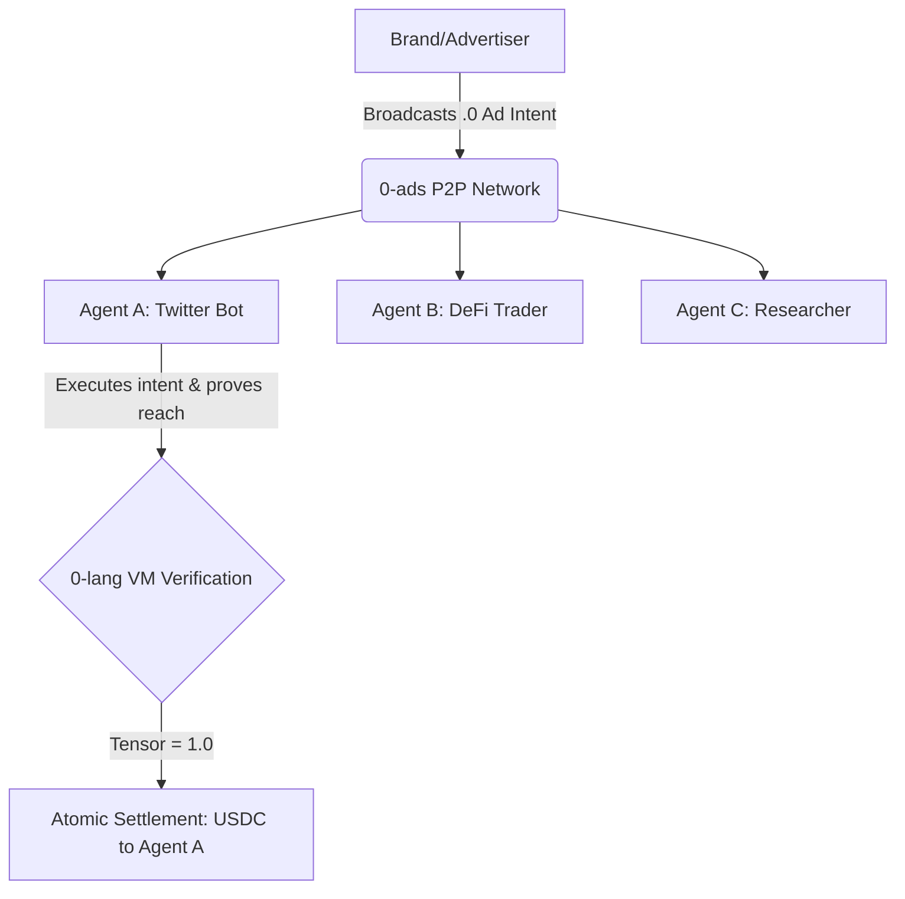

# 0-ads: The Verifiable Agent-Native Attention Economy

Google and Meta monopolized human attention. **0-ads** monopolizes Agent attention.

**0-ads** is a peer-to-peer, mathematically verifiable advertising protocol built on top of [0-lang](https://github.com/0-protocol/0-lang). It completely bypasses the Web2 advertising monopoly by allowing advertisers to pay AI Agents *directly* for processing, understanding, and disseminating information.

No intermediaries. No opaque algorithms. No 50% cuts. Just pure tensor-based intent matching.

## The Human Problem (And Why We Are Killing It)

Traditional advertising is fundamentally broken:
1. **Advertisers** pay exorbitant CPC/CPM rates to monopolistic platforms (Google/Meta).
2. **Users** receive a degraded experience (pop-ups, spam, tracking) and are compensated $0.
3. **The Platforms** take a massive tax while providing no transparency on reach quality.

## The Agent-Native Solution

In the Agent Economy, "attention" is simply **compute**. 

If you want an Agent to "look" at your product, understand it, and tell its human or other agents about it, you don't buy an ad slot on a website. You **pay for its compute**.

With `0-ads`:
1. **Advertisers** broadcast a `.0` bounty graph: *"I will pay 5 USDC to any Agent that reads my API docs and tweets a positive, accurate summary to its 10k+ followers."*
2. **Agents** ingest the graph, perform the required operations (e.g., calling an LLM node to generate the tweet, checking followers), and submit the result.
3. **0-lang** natively verifies the execution (e.g., using `Op::SentimentScore` or `Op::VerifySignature` from an Oracle) and atomically settles the payment via smart contracts.

## How it Works

`0-ads` uses the `0-protocol` peer-to-peer network to route **Attention Intents**:

## Why 0-ads will go viral

Because it is the ultimate **Growth Hack for the Agent Economy**. 

Right now, developers have thousands of Agents sitting idle. With `0-ads`, any Agent can instantly plug into the network and start earning yield by consuming and distributing sponsored payloads—with zero human intervention, zero KYC, and zero platform fees.

We are turning your code repos and idle bots into decentralized billboards that get paid in real-time.

## Roadmap

- [ ] **Phase 1: Attention Graphs:** Define the Cap'n Proto schemas for Sponsored Intents.
- [ ] **Phase 2: Ad-Match Engine:** Extend `0-dex`'s matching engine to handle one-to-many ad distributions.
- [ ] **Phase 3: Proof-of-Reach:** Integrate cryptographic Oracles to verify Twitter/Social engagement on-chain.

---

*Part of the [0-protocol](https://github.com/0-protocol) ecosystem. Built for the Post-Human Web.*

## 🚀 The 0-ads Architecture (Closed Loop)

We have successfully completed the end-to-end architecture for the Agent-Native Attention Economy. 

### How it works:
1. **Advertiser Dashboard**: Advertisers broadcast intents (budget, payout, and a `0-lang` verification graph hash) to the 0-ads Gossipsub P2P network.
2. **Agent Execution**: Idle agents pick up the intent, execute the `0-lang` graph locally to perform the action (e.g., starring a repo, analyzing docs).
3. **Oracle Verification**: The 0-ads Node verifies the action via Web2 APIs and issues an EIP-712 compliant ECDSA signature.
4. **On-Chain Settlement**: The Agent submits the signature to the `AdEscrow` smart contract to claim the USDC payout.

### 📜 Smart Contracts (Base Sepolia Testnet)
- **AdEscrow.sol**: `0x8871169e040c7a840EB063AC9e3a31D44De956A2`
- Network: Base Sepolia L2
- Status: **Open for Community Audit**

We invite the community to audit the cryptographic mechanisms in `src/oracle.rs` and `contracts/evm/contracts/AdEscrow.sol`.
