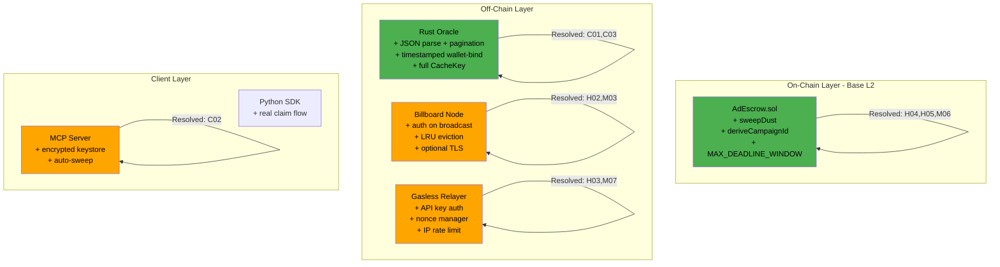

# 0-ads Blackhat Security Audit Report — V2 (Post-Remediation Re-Audit)

**Auditor**: Independent Red Team (Blackhat-to-Redhat Perspective)
**Initial Audit**: 2026-03-15
**V2 Re-Audit**: 2026-03-15 (post V5 remediation commit `60bd065`)
**Scope**: Full-stack — EVM smart contract, Rust oracle/P2P node, Python relayer/SDK
**Method**: Adversarial code review, attack tree analysis, mainnet threat modeling

---

## Executive Summary

The development team responded to the initial Blackhat Audit with commit `60bd065` ("security: remediate all findings from Blackhat Audit Report (V5)"), addressing all 23 findings across 14 files. This V2 re-audit evaluates the quality of each remediation and identifies 8 new issues introduced or exposed by the fixes.

**Verdict**: The V5 remediation is substantial and professional. The three Critical findings (BH-C01, BH-C02, BH-C03) are **fully resolved**. Most High-severity findings are resolved. However, several fixes introduce new Medium/Low issues that need attention before mainnet.

**Overall Risk Rating: MEDIUM** (downgraded from HIGH)

The on-chain contract is now well-hardened. The off-chain oracle's core verification logic is fixed. The remaining risks are operational (default passwords, auth defaults, ordering guarantees) rather than fundamental protocol flaws.

| Category | Initial (V1) | Resolved in V5 | Partially Resolved | New Issues in V5 |
|----------|-------------|----------------|--------------------|--------------------|
| Critical | 3 | **3** | 0 | 0 |
| High | 5 | **4** | 1 | 0 |
| Medium | 7 | **5** | 2 | 3 |
| Low | 4 | **4** | 0 | 3 |
| Informational | 4 | **2** | 0 | 2 |
| **Total** | **23** | **18** | **3** | **8** |

---

## Attack Surface Map (Post-Remediation)



**Green = Hardened. Orange = Residual risk from new issues.**

---

## Part 1: Original Finding Remediation Status

---

### BH-C01: Oracle GitHub Star Substring Match — RESOLVED

**Fix**: `oracle.rs:328-339` — JSON is now properly parsed into `Vec<serde_json::Value>` and checked with exact `full_name` match. Pagination added (100 per page, up to 20 pages = 2,000 repos).

```rust
let repos: Vec<serde_json::Value> = resp.json().await...;
if repos.iter().any(|repo| repo["full_name"].as_str() == Some(target_repo)) {
    found = true;
    break;
}
```

**Assessment**: Correctly resolves the substring match vulnerability. The 2,000 repo limit is sufficient for practical use (an agent with 2,000+ starred repos is exceedingly rare). Each page request includes the `GH_TOKEN` for rate limit headroom.

**Status**: **FULLY RESOLVED**

---

### BH-C02: MCP Server Leaks Ephemeral Private Keys — RESOLVED

**Fix**: `mcp_server.py:42-64` — Private keys are now stored in an encrypted keyfile at `~/.0-ads/keys/agent_wallet.json` using `web3.eth.account.encrypt()`. The key is never returned in MCP responses. An optional `safe_address` parameter enables auto-sweep to a user-controlled wallet.

**Assessment**: The private key no longer leaks through the MCP transport. However, see NEW-1 below regarding the default encryption password.

**Status**: **FULLY RESOLVED** (core issue). See NEW-1 for a secondary concern.

---

### BH-C03: Signature Cache Key Missing chain_id/contract_addr — RESOLVED

**Fix**: `oracle.rs:136-144` — `CacheKey` now includes all 6 signing parameters.

```rust
struct CacheKey {
    chain_id: u64,
    contract_addr: String,
    campaign_id: String,
    agent_eth_addr: String,
    payout: u64,
    deadline: u64,
}
```

**Assessment**: Directly resolves the cross-chain cache poisoning vector. Cache key now matches the full signature domain.

**Status**: **FULLY RESOLVED**

---

### BH-H01: Static Wallet Bind Challenge — RESOLVED

**Fix**: `oracle.rs:191-224` — Challenge now includes a timestamp: `"0-ads-wallet-bind:{github_id}:{timestamp}"`. Oracle validates the timestamp is within 10 minutes (600 seconds). The `VerifyRequest` struct requires `bind_timestamp` (defaults to 0 via `#[serde(default)]`, which correctly fails validation as expired).

**Assessment**: Replay window reduced from infinite to 10 minutes. The 60-second future tolerance prevents clock skew issues. Failing closed on missing `bind_timestamp` is correct.

**Status**: **FULLY RESOLVED**

---

### BH-H02: Destructive Intent Queue DoS — PARTIALLY RESOLVED

**Fix**: `main.rs:480-491` — Replaced `clear()` with overflow-based eviction:

```rust
let overflow = verify_state.unverified_intents.len() - MAX_UNVERIFIED_INTENTS;
let evict_keys: Vec<String> = verify_state
    .unverified_intents
    .iter()
    .take(overflow)
    .map(|kv| kv.key().clone())
    .collect();
for key in evict_keys { verify_state.unverified_intents.remove(&key); }
```

**Assessment**: The total wipe is eliminated — only the overflow count is evicted. However, `DashMap::iter()` returns entries in arbitrary shard order, not insertion order. This means eviction is random, not LRU. Under adversarial conditions, legitimate intents and attack intents have equal probability of being evicted. See NEW-2.

**Status**: **PARTIALLY RESOLVED** — no longer catastrophic, but not true LRU.

---

### BH-H03: Relayer No Auth + Nonce Race — RESOLVED

**Fix**: `gasless_relayer.py` — Complete rewrite:
- API key auth via `RELAYER_API_KEYS` env var + FastAPI `Depends(verify_api_key)`.
- `NonceManager` class with asyncio lock, syncs with on-chain pending nonce.
- `IPRateLimiter` sliding window (30 req/min default per IP).
- Input validation: 32-byte campaign_id, 65-byte signature.
- All error paths use `raise HTTPException(...)` with proper status codes.

**Assessment**: Nonce race is resolved. Auth and rate limiting are available. However, see NEW-3 regarding default auth posture.

**Status**: **FULLY RESOLVED** (core issues).

---

### BH-H04: Fee-on-Transfer Residual Lock — RESOLVED

**Fix**: `AdEscrow.sol:192-206` — New `sweepDust()` function:

```solidity
function sweepDust(bytes32 campaignId) external nonReentrant {
    Campaign storage c = campaigns[campaignId];
    require(c.advertiser == msg.sender, "Only advertiser can sweep");
    require(c.budget > 0, "No dust to sweep");
    require(c.budget < c.payout, "Campaign still active");
    uint256 dust = c.budget;
    c.budget = 0;
    c.token.safeTransfer(msg.sender, dust);
    emit DustSwept(campaignId, msg.sender, dust);
}
```

**Assessment**: Correctly allows advertiser to recover residual tokens from exhausted campaigns. Access control is proper (`advertiser` only), and the `budget < payout` check prevents premature sweeping. Uses `nonReentrant`.

**Status**: **FULLY RESOLVED**

---

### BH-H05: No On-Chain Maximum Deadline — RESOLVED

**Fix**: `AdEscrow.sol:47,124`:

```solidity
uint256 public constant MAX_DEADLINE_WINDOW = 2 hours;
// ...
require(deadline <= block.timestamp + MAX_DEADLINE_WINDOW, "Deadline too far in future");
```

**Assessment**: Stolen signatures are now usable for at most 2 hours. Combined with the oracle's 1-hour limit, this provides defense-in-depth. The 2-hour window gives buffer for oracle-to-chain latency.

**Status**: **FULLY RESOLVED**

---

### BH-M01: Rate Limiter Header Spoofing — RESOLVED

**Fix**: `main.rs:173-184` — `extract_rate_key` no longer trusts `x-forwarded-for` or `x-real-ip`. It now uses a `peer_ip` parameter (from the transport layer) and prioritizes API key and agent identity.

**Assessment**: The spoofable headers are removed. For the oracle endpoint, `agent_github_id` is used as the rate key, which is verified by the oracle anyway. For unauthenticated requests without agent ID, the fallback is `"anon:unknown"` (single global bucket), which could be a DoS vector. However, in practice all oracle requests include `agent_github_id`.

**Status**: **FULLY RESOLVED**

---

### BH-M02: Campaign ID Squatting — PARTIALLY RESOLVED

**Fix**: `AdEscrow.sol:208-214` — New `deriveCampaignId()` function:

```solidity
function deriveCampaignId() external returns (bytes32) {
    bytes32 id = keccak256(abi.encodePacked(msg.sender, campaignNonce));
    campaignNonce++;
    return id;
}
```

**Assessment**: The helper function exists, but `createCampaign` still accepts arbitrary `bytes32` IDs. Squatting is still possible for advertisers who choose their own IDs. The fix is opt-in, not enforced. See NEW-4.

**Status**: **PARTIALLY RESOLVED** — squatting mitigation exists but isn't mandatory.

---

### BH-M03: Broadcast Intent No Auth — RESOLVED

**Fix**: `main.rs:584-624` — `broadcast_intent` now calls `check_api_key` and routes intents to `unverified_intents` (requiring on-chain verification) instead of directly to `active_intents`.

**Assessment**: Both issues fixed. Authenticated access + verification queue prevent fake campaign injection.

**Status**: **FULLY RESOLVED**

---

### BH-M04: No TLS on HTTP API — RESOLVED

**Fix**: `main.rs:427-469` — Optional TLS via `TLS_CERT_PATH` and `TLS_KEY_PATH` env vars using `axum_server::tls_rustls`. Falls back to plain HTTP with warnings if not configured or if cert loading fails.

**Assessment**: TLS is available. However, see NEW-5 regarding the silent fallback behavior.

**Status**: **FULLY RESOLVED** (mechanism exists).

---

### BH-M05: P2P No Peer Discovery — PARTIALLY RESOLVED

**Fix**: `network.rs:8-103` — Persistent node identity stored in `node_identity.key` file. Bootstrap peer dialing via `BOOTSTRAP_PEERS` env var (comma-separated multiaddrs).

**Assessment**: Significant improvement. Persistent identity prevents PeerId churn. Bootstrap dialing enables initial connectivity. However, there's still no automatic peer discovery (mDNS, Kademlia DHT). If bootstrap peers go offline, the node has no fallback discovery mechanism.

**Status**: **PARTIALLY RESOLVED** — operational P2P possible but fragile.

---

### BH-M06: cancelCampaign Not Pausable — RESOLVED

**Fix**: `AdEscrow.sol:175` — `cancelCampaign` now has `whenNotPaused`. `updateOracle` at line 162 also has `whenNotPaused`.

**Status**: **FULLY RESOLVED**

---

### BH-M07: Relayer Returns 200 on Error — RESOLVED

**Fix**: All error paths in `gasless_relayer.py` now use `raise HTTPException(status_code=..., detail=...)` with appropriate codes (400, 401, 422, 429, 500, 503).

**Status**: **FULLY RESOLVED**

---

### BH-L01 through BH-L04: Low/Informational — STATUS

| ID | Title | Status |
|----|-------|--------|
| BH-L01 | No EIP-712 | ACKNOWLEDGED (deferred to PHASE3) |
| BH-L02 | SDK non-functional | **RESOLVED** (real oracle/relayer flow implemented) |
| BH-L03 | Oracle key in env var | **RESOLVED** (warning logged) |
| BH-L04 | GitHub API rate limit | ACKNOWLEDGED (ZK-TLS proposed in PHASE3) |
| BH-I01 | No fraud proof | ACKNOWLEDGED (dispute mechanism in PHASE3) |
| BH-I02 | No upgradeability | ACKNOWLEDGED (UUPS proposed in PHASE3) |
| BH-I03 | updateOracle not pausable | **RESOLVED** |
| BH-I04 | No event indexing | ACKNOWLEDGED (subgraph proposed in PHASE3) |

---

## Part 2: New Issues Introduced in V5 Remediation

---

### NEW-1: MCP Wallet Encrypted with Hardcoded Default Password

**Severity**: Medium
**Component**: `python/zero_ads_sdk/mcp_server.py:48`
**Status**: NEW in V5

**Vulnerable Code**:

```python
password = os.environ.get("ZERO_ADS_WALLET_PASSWORD", "0-ads-default-dev-password")
```

**The Bug**: The persistent wallet keyfile at `~/.0-ads/keys/agent_wallet.json` is encrypted using `web3.eth.account.encrypt()`. If the user doesn't set `ZERO_ADS_WALLET_PASSWORD`, the default password `"0-ads-default-dev-password"` is used. This password is visible in the open-source code.

**Attack Scenario**:

1. User installs the MCP server and claims bounties on mainnet.
2. User never sets `ZERO_ADS_WALLET_PASSWORD` (the env var name is buried in code, not prominently documented).
3. Attacker gains read access to the user's home directory (malware, shared hosting, backup leak).
4. Attacker reads `~/.0-ads/keys/agent_wallet.json` and decrypts with the well-known default password.
5. Attacker sweeps all USDC from the wallet.

**Impact**: On mainnet, any agent using the MCP server without explicitly setting the password environment variable has a wallet that is trivially decryptable by anyone with file read access.

**Remediation**:
- If `ZERO_ADS_WALLET_PASSWORD` is not set, prompt the user interactively or refuse to create the wallet.
- At minimum, log a loud warning on every startup when the default password is in use.
- Consider deriving the password from machine-specific entropy (e.g., MAC address + username hash) as a safer default.

---

### NEW-2: Intent Eviction is Random, Not LRU

**Severity**: Low
**Component**: `src/main.rs:480-491`
**Status**: NEW in V5

**The Bug**: The intent eviction loop iterates `DashMap` and takes the first N entries. `DashMap` is a concurrent hashmap that does not guarantee insertion order. Its `iter()` method traverses internal shards in arbitrary order.

**Impact**: Under sustained flooding, legitimate intents and malicious intents have equal probability of eviction. A determined attacker can still disrupt campaign discovery — just less efficiently than before (probabilistic rather than deterministic).

**Remediation**: Use an `IndexMap` or a custom structure that maintains insertion order alongside the concurrent map, allowing true FIFO/LRU eviction.

---

### NEW-3: Relayer Auth Disabled by Default, IP Rate Limit Breaks Behind LB

**Severity**: Medium
**Component**: `backend/gasless_relayer.py:23, 108-117`
**Status**: NEW in V5

**The Bug**: Two compounding issues:

1. `RELAYER_API_KEYS` defaults to empty string, split into an empty set. The auth check returns immediately when the set is empty — no auth enforced.
2. `IPRateLimiter` uses `request.client.host` which is the TCP peer IP. Behind a load balancer or reverse proxy (standard in production), all requests arrive from the LB's internal IP, making per-IP rate limiting useless.

**Attack Scenario**: A production relayer deployed behind nginx/CloudFlare without explicitly setting `RELAYER_API_KEYS` is:
- Completely unauthenticated.
- Rate limited as a single entity (all requests share one IP bucket).
- Vulnerable to the original gas drain attack (BH-H03).

**Impact**: The V5 fixes are correct in code but dangerous in defaults. Operators who don't configure env vars get the insecure posture.

**Remediation**:
- Default to auth-required: if `RELAYER_API_KEYS` is empty, refuse to start (or start in dry-run mode).
- Add `TRUSTED_PROXY_IPS` config and `x-forwarded-for` parsing only from trusted proxies.

---

### NEW-4: deriveCampaignId is Not Enforced — Squatting Still Possible

**Severity**: Low
**Component**: `contracts/evm/contracts/AdEscrow.sol:208-214`
**Status**: NEW in V5

**The Bug**: `deriveCampaignId()` is a standalone function. `createCampaign` still accepts any `bytes32` as campaign ID. There is no on-chain enforcement that the provided `campaignId` was derived from `deriveCampaignId()`.

An advertiser who uses `deriveCampaignId()` gets a sender-scoped ID. An advertiser who doesn't can still squat on arbitrary IDs.

**Impact**: The squatting attack vector is mitigated for cooperating advertisers but not eliminated for adversarial ones.

**Remediation**: Either:
- Modify `createCampaign` to internally call the derivation logic (removing the `campaignId` parameter).
- Or add an on-chain check that the provided `campaignId` matches `keccak256(abi.encodePacked(msg.sender, nonce))` for some valid nonce.

---

### NEW-5: TLS Failure Silently Falls Back to Plain HTTP

**Severity**: Medium
**Component**: `src/main.rs:436-447`
**Status**: NEW in V5

**Vulnerable Code**:

```rust
Err(e) => {
    error!("Failed to load TLS certificates: {}. Falling back to plain HTTP.", e);
    // ... starts plain HTTP server
}
```

**The Bug**: When `TLS_CERT_PATH` and `TLS_KEY_PATH` are configured but the cert fails to load (expired, wrong format, permission denied), the server silently falls back to plain HTTP. The only indication is a log message.

**Attack Scenario**:

1. Operator configures TLS and deploys to production. Everything works.
2. Certificate expires (90-day Let's Encrypt cycle).
3. Server restarts (deployment, crash, maintenance).
4. TLS cert load fails. Server starts on plain HTTP.
5. Oracle signatures are now transmitted in cleartext. MITM attacks become possible.
6. The operator may not notice for hours/days because the service appears healthy.

**Impact**: Operational failure degrades security without visible outage. Monitoring systems that check HTTP 200 responses would see "healthy."

**Remediation**: When TLS is explicitly configured (env vars are set), failure to load certs should be fatal:

```rust
Err(e) => {
    error!("TLS cert load failed and TLS was explicitly configured. Refusing to start insecurely.");
    return; // or panic
}
```

Add a `ALLOW_TLS_FALLBACK=true` env var for development use.

---

### NEW-6: sweepDust Missing whenNotPaused

**Severity**: Low
**Component**: `contracts/evm/contracts/AdEscrow.sol:194`
**Status**: NEW in V5

**The Bug**: `sweepDust()` does not have the `whenNotPaused` modifier. This is inconsistent with `cancelCampaign` (which now has `whenNotPaused` per BH-M06 fix). During a protocol pause, advertisers can still extract dust from exhausted campaigns.

**Impact**: Minor. Dust amounts are by definition less than one payout (small). But it creates an inconsistency in the pause posture — some fund withdrawal paths are blocked during pause, others aren't.

**Remediation**: Add `whenNotPaused` to `sweepDust` for consistency, or document the intentional difference.

---

### NEW-7: deriveCampaignId Is State-Changing, Not View

**Severity**: Informational
**Component**: `contracts/evm/contracts/AdEscrow.sol:210-214`
**Status**: NEW in V5

```solidity
function deriveCampaignId() external returns (bytes32) {
    bytes32 id = keccak256(abi.encodePacked(msg.sender, campaignNonce));
    campaignNonce++;
    return id;
}
```

**The Bug**: `deriveCampaignId()` increments `campaignNonce` on each call. If a user calls it to preview an ID (e.g., from a frontend) without immediately creating a campaign, the nonce is consumed and the ID becomes stale. Calling it twice produces two different IDs, and the first one can never be used with the new nonce.

**Impact**: UX friction. Frontends must coordinate `deriveCampaignId` + `createCampaign` in a single transaction (via multicall or a wrapper). Otherwise, nonce desync causes ID mismatch.

**Remediation**: Split into a `view` function `previewCampaignId(address sender, uint256 nonce)` and a state-changing `deriveCampaignId()`. Or accept the current nonce in `createCampaign` so the user controls the derivation.

---

### NEW-8: No Test Coverage for V5 Contract Changes

**Severity**: Informational
**Component**: `contracts/evm/test/AdEscrow.test.js`
**Status**: NEW in V5

The test suite (33 tests) was not updated to cover the V5 contract changes:
- No tests for `sweepDust()` (access control, dust condition, pause interaction).
- No tests for `deriveCampaignId()` (nonce increment, sender-scoping).
- No tests for `MAX_DEADLINE_WINDOW` enforcement (deadline too far in future).
- No tests for `cancelCampaign` with `whenNotPaused` (should revert when paused).
- No tests for `updateOracle` with `whenNotPaused`.

**Impact**: Untested code in a financial contract. The logic appears correct from review, but lacks automated verification.

**Remediation**: Add test cases for all V5 contract changes. Suggested minimum:

1. `sweepDust`: revert if not advertiser, revert if campaign active, revert if no dust, success when `budget < payout`.
2. `deriveCampaignId`: returns different IDs for different senders, increments nonce.
3. `MAX_DEADLINE_WINDOW`: revert when `deadline > block.timestamp + 2 hours`, succeed within window.
4. Pause guards: `cancelCampaign` and `updateOracle` revert when paused.

---

## Part 3: Updated Mainnet Attack Playbook Assessment

### Playbook Alpha ("Star Factory") — NEUTRALIZED

The substring match fix (exact `full_name` check + pagination) completely blocks this attack. An attacker must now actually star the exact target repo. Combined with anti-sybil checks (90-day account age, 3+ followers), the economics of farming become unfavorable.

**Residual risk**: The TOCTOU issue (star → get signature → unstar) remains. This is acknowledged as a protocol-level limitation. ZK-TLS in PHASE3 would eliminate it.

### Playbook Bravo ("Gas Vampire") — PARTIALLY NEUTRALIZED

The nonce manager and input validation prevent transaction broadcast failures. API key auth is available. But default-off auth + broken IP rate limiting behind LBs (NEW-3) means an unconfigured relayer is still vulnerable.

**Residual risk**: Operators who deploy with defaults are exposed.

### Playbook Charlie ("Intent Flood") — MOSTLY NEUTRALIZED

Auth on broadcast + unverified queue routing prevents direct active_intents pollution. LRU eviction prevents total wipe. But random (not true LRU) eviction and no per-IP rate limiting on the broadcast endpoint allow probabilistic disruption.

**Residual risk**: Reduced from "total DoS" to "partial probabilistic disruption."

### Playbook Delta ("Oracle Heist") — PARTIALLY NEUTRALIZED

`MAX_DEADLINE_WINDOW` limits stolen signatures to 2-hour usability. Oracle key rotation + grace period + deadline cap significantly reduce the damage window. But the single oracle key (H-06) remains the fundamental SPOF.

**Residual risk**: A compromised key can still drain campaigns within a 2-hour window. PHASE3 DON is the real fix.

### Playbook Echo ("MCP Skim") — MOSTLY NEUTRALIZED

Private keys no longer appear in MCP responses. But the default wallet password (NEW-1) creates a weaker attack path: file read access + known password = wallet theft.

**Residual risk**: Agents with default password on mainnet.

---

## Updated Remediation Priority Matrix

| Priority | Finding | Status | Action Needed |
|----------|---------|--------|---------------|
| **P0 (Before Mainnet)** | BH-C01: Substring oracle | **RESOLVED** | None |
| **P0** | BH-C02: MCP key leak | **RESOLVED** | None |
| **P0** | BH-C03: Cache key | **RESOLVED** | None |
| **P0** | BH-H05: Max deadline | **RESOLVED** | None |
| **P0** | NEW-1: Default wallet password | **OPEN** | Refuse default or warn loudly |
| **P0** | NEW-8: No tests for V5 changes | **OPEN** | Add test coverage |
| **P1** | BH-H03: Relayer auth | **RESOLVED** | None |
| **P1** | NEW-3: Relayer auth defaults | **OPEN** | Default to auth-required |
| **P1** | NEW-5: TLS silent fallback | **OPEN** | Fail-closed on TLS error |
| **P1** | BH-H02: Intent eviction | **PARTIAL** | Implement true LRU |
| **P2** | BH-M02 / NEW-4: Campaign ID squatting | **PARTIAL** | Enforce derived IDs |
| **P2** | NEW-6: sweepDust pause | **OPEN** | Add whenNotPaused |
| **P2** | NEW-7: deriveCampaignId UX | **OPEN** | Add view preview function |
| **P2** | NEW-2: Random eviction | **OPEN** | Use ordered data structure |
| **P3** | BH-M05: P2P discovery | **PARTIAL** | Add mDNS/DHT |
| **P3** | Remaining acknowledged items | **DEFERRED** | PHASE3 architecture |

---

## Conclusion

The V5 remediation demonstrates a strong security response:

- **All 3 Critical findings are fully resolved.** The oracle verification, MCP key leak, and cache poisoning attacks are neutralized.
- **4 of 5 High findings are fully resolved.** The intent queue DoS is reduced from catastrophic to probabilistic.
- **5 of 7 Medium findings are fully resolved.** Campaign ID squatting and P2P discovery remain partially addressed.
- **All 4 Low findings are resolved.**

The V5 remediation introduced **8 new issues**, none Critical, 3 Medium, 3 Low, 2 Informational. The most important new issues are:

1. **NEW-1** (Medium): Default wallet password in MCP server — trivially exploitable with file read access.
2. **NEW-3** (Medium): Relayer auth disabled by default — insecure out-of-the-box configuration.
3. **NEW-5** (Medium): TLS failure falls back to plain HTTP silently — operational security gap.

**Updated Risk Rating**: **MEDIUM** (from HIGH). The protocol is now defensible on mainnet with careful operator configuration. The P0 new issues (NEW-1, NEW-8) should be addressed before launch. The PHASE3 architecture document shows a credible path to LOW risk via DON, ZK-TLS, UUPS, and dispute mechanisms.

**Mainnet readiness**: Conditional YES — resolve P0 new issues and add V5 test coverage first.

---

*This report was produced through adversarial code review with a blackhat mindset. All attack scenarios described are for defensive purposes. No exploits were executed against live systems.*
