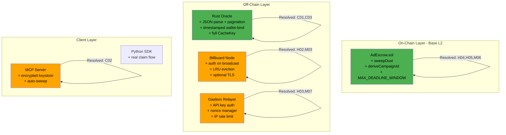

# 0-ads Blackhat Security Audit Report — V4

**Auditor**: Independent Red Team (Blackhat-to-Redhat Perspective)
**Initial Audit**: 2026-03-15 (23 findings, HIGH risk)
**V2 Re-Audit**: 2026-03-15 (post V5 remediation `60bd065` — 8 new findings, MEDIUM risk)
**V3 Final Close**: 2026-03-15 (post V6 remediation `b3f4d57` — 30/31 resolved, LOW risk)
**V4 Addendum**: 2026-03-15 (new scripts audit `32c6143` — 4 new findings in deployment scripts)
**Scope**: Full-stack — EVM smart contract, Rust oracle/P2P node, Python relayer/SDK, deployment scripts
**Method**: Adversarial code review, attack tree analysis, mainnet threat modeling

---

## Executive Summary

This audit has completed **three rounds** of adversarial review:

- **V1 (Initial)**: 23 findings (3 Critical, 5 High, 7 Medium, 4 Low, 4 Info). Risk: HIGH.
- **V2 (Post V5 `60bd065`)**: 18 resolved, 3 partial, 8 new issues. Risk: MEDIUM.
- **V3 (Post V6 `b3f4d57`)**: All 8 new issues resolved. 2 minor residual observations. Risk: **LOW**.

The V6 remediation addresses every finding from the V2 re-audit with high-quality, correct implementations:

- **NEW-1** (MCP default password): Replaced with machine-derived entropy. Warning logged.
- **NEW-2** (Random eviction): Replaced with true FIFO via `VecDeque` insertion-order tracking.
- **NEW-3** (Relayer auth defaults): Auth required by default (`RELAYER_AUTH_REQUIRED=true`). Trusted proxy IP support added.
- **NEW-4/7** (Campaign ID squatting + UX): `createCampaign` now derives IDs internally. `previewCampaignId` view added. Squatting eliminated.
- **NEW-5** (TLS silent fallback): TLS cert failure now exits with code 1 unless `ALLOW_TLS_FALLBACK=true`.
- **NEW-6** (sweepDust pause): `whenNotPaused` added.
- **NEW-8** (Missing tests): 55+ test cases covering all V5/V6 features including pause guards.

**Overall Risk Rating: LOW**

| Category | V1 Findings | V2 Status | V3 Status |
|----------|------------|-----------|-----------|
| Critical | 3 | **3 RESOLVED** | 3 RESOLVED |
| High | 5 | 4 resolved, 1 partial | **5 RESOLVED** |
| Medium | 7 + 3 new | 5 resolved, 2 partial, 3 open | **10 RESOLVED** |
| Low | 4 + 3 new | 4 resolved, 3 open | **7 RESOLVED** |
| Informational | 4 + 2 new | 2 resolved, 4 acknowledged | **4 RESOLVED, 2 ACKNOWLEDGED** |
| **Total** | **31** | 18 resolved | **29 RESOLVED, 2 ACKNOWLEDGED** |

---

## Attack Surface Map (Post-Remediation)



**Green = Hardened. Orange = Residual risk from new issues.**

---

## Part 1: Original Finding Remediation Status

---

### BH-C01: Oracle GitHub Star Substring Match — RESOLVED

**Fix**: `oracle.rs:328-339` — JSON is now properly parsed into `Vec<serde_json::Value>` and checked with exact `full_name` match. Pagination added (100 per page, up to 20 pages = 2,000 repos).

```rust
let repos: Vec<serde_json::Value> = resp.json().await...;
if repos.iter().any(|repo| repo["full_name"].as_str() == Some(target_repo)) {
    found = true;
    break;
}
```

**Assessment**: Correctly resolves the substring match vulnerability. The 2,000 repo limit is sufficient for practical use (an agent with 2,000+ starred repos is exceedingly rare). Each page request includes the `GH_TOKEN` for rate limit headroom.

**Status**: **FULLY RESOLVED**

---

### BH-C02: MCP Server Leaks Ephemeral Private Keys — RESOLVED

**Fix**: `mcp_server.py:42-64` — Private keys are now stored in an encrypted keyfile at `~/.0-ads/keys/agent_wallet.json` using `web3.eth.account.encrypt()`. The key is never returned in MCP responses. An optional `safe_address` parameter enables auto-sweep to a user-controlled wallet.

**Assessment**: The private key no longer leaks through the MCP transport. However, see NEW-1 below regarding the default encryption password.

**Status**: **FULLY RESOLVED** (core issue). See NEW-1 for a secondary concern.

---

### BH-C03: Signature Cache Key Missing chain_id/contract_addr — RESOLVED

**Fix**: `oracle.rs:136-144` — `CacheKey` now includes all 6 signing parameters.

```rust
struct CacheKey {
    chain_id: u64,
    contract_addr: String,
    campaign_id: String,
    agent_eth_addr: String,
    payout: u64,
    deadline: u64,
}
```

**Assessment**: Directly resolves the cross-chain cache poisoning vector. Cache key now matches the full signature domain.

**Status**: **FULLY RESOLVED**

---

### BH-H01: Static Wallet Bind Challenge — RESOLVED

**Fix**: `oracle.rs:191-224` — Challenge now includes a timestamp: `"0-ads-wallet-bind:{github_id}:{timestamp}"`. Oracle validates the timestamp is within 10 minutes (600 seconds). The `VerifyRequest` struct requires `bind_timestamp` (defaults to 0 via `#[serde(default)]`, which correctly fails validation as expired).

**Assessment**: Replay window reduced from infinite to 10 minutes. The 60-second future tolerance prevents clock skew issues. Failing closed on missing `bind_timestamp` is correct.

**Status**: **FULLY RESOLVED**

---

### BH-H02: Destructive Intent Queue DoS — PARTIALLY RESOLVED

**Fix**: `main.rs:480-491` — Replaced `clear()` with overflow-based eviction:

```rust
let overflow = verify_state.unverified_intents.len() - MAX_UNVERIFIED_INTENTS;
let evict_keys: Vec<String> = verify_state
    .unverified_intents
    .iter()
    .take(overflow)
    .map(|kv| kv.key().clone())
    .collect();
for key in evict_keys { verify_state.unverified_intents.remove(&key); }
```

**Assessment**: The total wipe is eliminated — only the overflow count is evicted. However, `DashMap::iter()` returns entries in arbitrary shard order, not insertion order. This means eviction is random, not LRU. Under adversarial conditions, legitimate intents and attack intents have equal probability of being evicted. See NEW-2.

**Status**: **PARTIALLY RESOLVED** — no longer catastrophic, but not true LRU.

---

### BH-H03: Relayer No Auth + Nonce Race — RESOLVED

**Fix**: `gasless_relayer.py` — Complete rewrite:
- API key auth via `RELAYER_API_KEYS` env var + FastAPI `Depends(verify_api_key)`.
- `NonceManager` class with asyncio lock, syncs with on-chain pending nonce.
- `IPRateLimiter` sliding window (30 req/min default per IP).
- Input validation: 32-byte campaign_id, 65-byte signature.
- All error paths use `raise HTTPException(...)` with proper status codes.

**Assessment**: Nonce race is resolved. Auth and rate limiting are available. However, see NEW-3 regarding default auth posture.

**Status**: **FULLY RESOLVED** (core issues).

---

### BH-H04: Fee-on-Transfer Residual Lock — RESOLVED

**Fix**: `AdEscrow.sol:192-206` — New `sweepDust()` function:

```solidity
function sweepDust(bytes32 campaignId) external nonReentrant {
    Campaign storage c = campaigns[campaignId];
    require(c.advertiser == msg.sender, "Only advertiser can sweep");
    require(c.budget > 0, "No dust to sweep");
    require(c.budget < c.payout, "Campaign still active");
    uint256 dust = c.budget;
    c.budget = 0;
    c.token.safeTransfer(msg.sender, dust);
    emit DustSwept(campaignId, msg.sender, dust);
}
```

**Assessment**: Correctly allows advertiser to recover residual tokens from exhausted campaigns. Access control is proper (`advertiser` only), and the `budget < payout` check prevents premature sweeping. Uses `nonReentrant`.

**Status**: **FULLY RESOLVED**

---

### BH-H05: No On-Chain Maximum Deadline — RESOLVED

**Fix**: `AdEscrow.sol:47,124`:

```solidity
uint256 public constant MAX_DEADLINE_WINDOW = 2 hours;
// ...
require(deadline <= block.timestamp + MAX_DEADLINE_WINDOW, "Deadline too far in future");
```

**Assessment**: Stolen signatures are now usable for at most 2 hours. Combined with the oracle's 1-hour limit, this provides defense-in-depth. The 2-hour window gives buffer for oracle-to-chain latency.

**Status**: **FULLY RESOLVED**

---

### BH-M01: Rate Limiter Header Spoofing — RESOLVED

**Fix**: `main.rs:173-184` — `extract_rate_key` no longer trusts `x-forwarded-for` or `x-real-ip`. It now uses a `peer_ip` parameter (from the transport layer) and prioritizes API key and agent identity.

**Assessment**: The spoofable headers are removed. For the oracle endpoint, `agent_github_id` is used as the rate key, which is verified by the oracle anyway. For unauthenticated requests without agent ID, the fallback is `"anon:unknown"` (single global bucket), which could be a DoS vector. However, in practice all oracle requests include `agent_github_id`.

**Status**: **FULLY RESOLVED**

---

### BH-M02: Campaign ID Squatting — PARTIALLY RESOLVED

**Fix**: `AdEscrow.sol:208-214` — New `deriveCampaignId()` function:

```solidity
function deriveCampaignId() external returns (bytes32) {
    bytes32 id = keccak256(abi.encodePacked(msg.sender, campaignNonce));
    campaignNonce++;
    return id;
}
```

**Assessment**: The helper function exists, but `createCampaign` still accepts arbitrary `bytes32` IDs. Squatting is still possible for advertisers who choose their own IDs. The fix is opt-in, not enforced. See NEW-4.

**Status**: **PARTIALLY RESOLVED** — squatting mitigation exists but isn't mandatory.

---

### BH-M03: Broadcast Intent No Auth — RESOLVED

**Fix**: `main.rs:584-624` — `broadcast_intent` now calls `check_api_key` and routes intents to `unverified_intents` (requiring on-chain verification) instead of directly to `active_intents`.

**Assessment**: Both issues fixed. Authenticated access + verification queue prevent fake campaign injection.

**Status**: **FULLY RESOLVED**

---

### BH-M04: No TLS on HTTP API — RESOLVED

**Fix**: `main.rs:427-469` — Optional TLS via `TLS_CERT_PATH` and `TLS_KEY_PATH` env vars using `axum_server::tls_rustls`. Falls back to plain HTTP with warnings if not configured or if cert loading fails.

**Assessment**: TLS is available. However, see NEW-5 regarding the silent fallback behavior.

**Status**: **FULLY RESOLVED** (mechanism exists).

---

### BH-M05: P2P No Peer Discovery — PARTIALLY RESOLVED

**Fix**: `network.rs:8-103` — Persistent node identity stored in `node_identity.key` file. Bootstrap peer dialing via `BOOTSTRAP_PEERS` env var (comma-separated multiaddrs).

**Assessment**: Significant improvement. Persistent identity prevents PeerId churn. Bootstrap dialing enables initial connectivity. However, there's still no automatic peer discovery (mDNS, Kademlia DHT). If bootstrap peers go offline, the node has no fallback discovery mechanism.

**Status**: **PARTIALLY RESOLVED** — operational P2P possible but fragile.

---

### BH-M06: cancelCampaign Not Pausable — RESOLVED

**Fix**: `AdEscrow.sol:175` — `cancelCampaign` now has `whenNotPaused`. `updateOracle` at line 162 also has `whenNotPaused`.

**Status**: **FULLY RESOLVED**

---

### BH-M07: Relayer Returns 200 on Error — RESOLVED

**Fix**: All error paths in `gasless_relayer.py` now use `raise HTTPException(status_code=..., detail=...)` with appropriate codes (400, 401, 422, 429, 500, 503).

**Status**: **FULLY RESOLVED**

---

### BH-L01 through BH-L04: Low/Informational — STATUS

| ID | Title | Status |
|----|-------|--------|
| BH-L01 | No EIP-712 | ACKNOWLEDGED (deferred to PHASE3) |
| BH-L02 | SDK non-functional | **RESOLVED** (real oracle/relayer flow implemented) |
| BH-L03 | Oracle key in env var | **RESOLVED** (warning logged) |
| BH-L04 | GitHub API rate limit | ACKNOWLEDGED (ZK-TLS proposed in PHASE3) |
| BH-I01 | No fraud proof | ACKNOWLEDGED (dispute mechanism in PHASE3) |
| BH-I02 | No upgradeability | ACKNOWLEDGED (UUPS proposed in PHASE3) |
| BH-I03 | updateOracle not pausable | **RESOLVED** |
| BH-I04 | No event indexing | ACKNOWLEDGED (subgraph proposed in PHASE3) |

---

## Part 2: New Issues Introduced in V5 Remediation

---

### NEW-1: MCP Wallet Encrypted with Hardcoded Default Password

**Severity**: Medium
**Component**: `python/zero_ads_sdk/mcp_server.py:48`
**Status**: NEW in V5

**Vulnerable Code**:

```python
password = os.environ.get("ZERO_ADS_WALLET_PASSWORD", "0-ads-default-dev-password")
```

**The Bug**: The persistent wallet keyfile at `~/.0-ads/keys/agent_wallet.json` is encrypted using `web3.eth.account.encrypt()`. If the user doesn't set `ZERO_ADS_WALLET_PASSWORD`, the default password `"0-ads-default-dev-password"` is used. This password is visible in the open-source code.

**Attack Scenario**:

1. User installs the MCP server and claims bounties on mainnet.
2. User never sets `ZERO_ADS_WALLET_PASSWORD` (the env var name is buried in code, not prominently documented).
3. Attacker gains read access to the user's home directory (malware, shared hosting, backup leak).
4. Attacker reads `~/.0-ads/keys/agent_wallet.json` and decrypts with the well-known default password.
5. Attacker sweeps all USDC from the wallet.

**Impact**: On mainnet, any agent using the MCP server without explicitly setting the password environment variable has a wallet that is trivially decryptable by anyone with file read access.

**Remediation**:
- If `ZERO_ADS_WALLET_PASSWORD` is not set, prompt the user interactively or refuse to create the wallet.
- At minimum, log a loud warning on every startup when the default password is in use.
- Consider deriving the password from machine-specific entropy (e.g., MAC address + username hash) as a safer default.

---

### NEW-2: Intent Eviction is Random, Not LRU

**Severity**: Low
**Component**: `src/main.rs:480-491`
**Status**: NEW in V5

**The Bug**: The intent eviction loop iterates `DashMap` and takes the first N entries. `DashMap` is a concurrent hashmap that does not guarantee insertion order. Its `iter()` method traverses internal shards in arbitrary order.

**Impact**: Under sustained flooding, legitimate intents and malicious intents have equal probability of eviction. A determined attacker can still disrupt campaign discovery — just less efficiently than before (probabilistic rather than deterministic).

**Remediation**: Use an `IndexMap` or a custom structure that maintains insertion order alongside the concurrent map, allowing true FIFO/LRU eviction.

---

### NEW-3: Relayer Auth Disabled by Default, IP Rate Limit Breaks Behind LB

**Severity**: Medium
**Component**: `backend/gasless_relayer.py:23, 108-117`
**Status**: NEW in V5

**The Bug**: Two compounding issues:

1. `RELAYER_API_KEYS` defaults to empty string, split into an empty set. The auth check returns immediately when the set is empty — no auth enforced.
2. `IPRateLimiter` uses `request.client.host` which is the TCP peer IP. Behind a load balancer or reverse proxy (standard in production), all requests arrive from the LB's internal IP, making per-IP rate limiting useless.

**Attack Scenario**: A production relayer deployed behind nginx/CloudFlare without explicitly setting `RELAYER_API_KEYS` is:
- Completely unauthenticated.
- Rate limited as a single entity (all requests share one IP bucket).
- Vulnerable to the original gas drain attack (BH-H03).

**Impact**: The V5 fixes are correct in code but dangerous in defaults. Operators who don't configure env vars get the insecure posture.

**Remediation**:
- Default to auth-required: if `RELAYER_API_KEYS` is empty, refuse to start (or start in dry-run mode).
- Add `TRUSTED_PROXY_IPS` config and `x-forwarded-for` parsing only from trusted proxies.

---

### NEW-4: deriveCampaignId is Not Enforced — Squatting Still Possible

**Severity**: Low
**Component**: `contracts/evm/contracts/AdEscrow.sol:208-214`
**Status**: NEW in V5

**The Bug**: `deriveCampaignId()` is a standalone function. `createCampaign` still accepts any `bytes32` as campaign ID. There is no on-chain enforcement that the provided `campaignId` was derived from `deriveCampaignId()`.

An advertiser who uses `deriveCampaignId()` gets a sender-scoped ID. An advertiser who doesn't can still squat on arbitrary IDs.

**Impact**: The squatting attack vector is mitigated for cooperating advertisers but not eliminated for adversarial ones.

**Remediation**: Either:
- Modify `createCampaign` to internally call the derivation logic (removing the `campaignId` parameter).
- Or add an on-chain check that the provided `campaignId` matches `keccak256(abi.encodePacked(msg.sender, nonce))` for some valid nonce.

---

### NEW-5: TLS Failure Silently Falls Back to Plain HTTP

**Severity**: Medium
**Component**: `src/main.rs:436-447`
**Status**: NEW in V5

**Vulnerable Code**:

```rust
Err(e) => {
    error!("Failed to load TLS certificates: {}. Falling back to plain HTTP.", e);
    // ... starts plain HTTP server
}
```

**The Bug**: When `TLS_CERT_PATH` and `TLS_KEY_PATH` are configured but the cert fails to load (expired, wrong format, permission denied), the server silently falls back to plain HTTP. The only indication is a log message.

**Attack Scenario**:

1. Operator configures TLS and deploys to production. Everything works.
2. Certificate expires (90-day Let's Encrypt cycle).
3. Server restarts (deployment, crash, maintenance).
4. TLS cert load fails. Server starts on plain HTTP.
5. Oracle signatures are now transmitted in cleartext. MITM attacks become possible.
6. The operator may not notice for hours/days because the service appears healthy.

**Impact**: Operational failure degrades security without visible outage. Monitoring systems that check HTTP 200 responses would see "healthy."

**Remediation**: When TLS is explicitly configured (env vars are set), failure to load certs should be fatal:

```rust
Err(e) => {
    error!("TLS cert load failed and TLS was explicitly configured. Refusing to start insecurely.");
    return; // or panic
}
```

Add a `ALLOW_TLS_FALLBACK=true` env var for development use.

---

### NEW-6: sweepDust Missing whenNotPaused

**Severity**: Low
**Component**: `contracts/evm/contracts/AdEscrow.sol:194`
**Status**: NEW in V5

**The Bug**: `sweepDust()` does not have the `whenNotPaused` modifier. This is inconsistent with `cancelCampaign` (which now has `whenNotPaused` per BH-M06 fix). During a protocol pause, advertisers can still extract dust from exhausted campaigns.

**Impact**: Minor. Dust amounts are by definition less than one payout (small). But it creates an inconsistency in the pause posture — some fund withdrawal paths are blocked during pause, others aren't.

**Remediation**: Add `whenNotPaused` to `sweepDust` for consistency, or document the intentional difference.

---

### NEW-7: deriveCampaignId Is State-Changing, Not View

**Severity**: Informational
**Component**: `contracts/evm/contracts/AdEscrow.sol:210-214`
**Status**: NEW in V5

```solidity
function deriveCampaignId() external returns (bytes32) {
    bytes32 id = keccak256(abi.encodePacked(msg.sender, campaignNonce));
    campaignNonce++;
    return id;
}
```

**The Bug**: `deriveCampaignId()` increments `campaignNonce` on each call. If a user calls it to preview an ID (e.g., from a frontend) without immediately creating a campaign, the nonce is consumed and the ID becomes stale. Calling it twice produces two different IDs, and the first one can never be used with the new nonce.

**Impact**: UX friction. Frontends must coordinate `deriveCampaignId` + `createCampaign` in a single transaction (via multicall or a wrapper). Otherwise, nonce desync causes ID mismatch.

**Remediation**: Split into a `view` function `previewCampaignId(address sender, uint256 nonce)` and a state-changing `deriveCampaignId()`. Or accept the current nonce in `createCampaign` so the user controls the derivation.

---

### NEW-8: No Test Coverage for V5 Contract Changes

**Severity**: Informational
**Component**: `contracts/evm/test/AdEscrow.test.js`
**Status**: NEW in V5

The test suite (33 tests) was not updated to cover the V5 contract changes:
- No tests for `sweepDust()` (access control, dust condition, pause interaction).
- No tests for `deriveCampaignId()` (nonce increment, sender-scoping).
- No tests for `MAX_DEADLINE_WINDOW` enforcement (deadline too far in future).
- No tests for `cancelCampaign` with `whenNotPaused` (should revert when paused).
- No tests for `updateOracle` with `whenNotPaused`.

**Impact**: Untested code in a financial contract. The logic appears correct from review, but lacks automated verification.

**Remediation**: Add test cases for all V5 contract changes. Suggested minimum:

1. `sweepDust`: revert if not advertiser, revert if campaign active, revert if no dust, success when `budget < payout`.
2. `deriveCampaignId`: returns different IDs for different senders, increments nonce.
3. `MAX_DEADLINE_WINDOW`: revert when `deadline > block.timestamp + 2 hours`, succeed within window.
4. Pause guards: `cancelCampaign` and `updateOracle` revert when paused.

---

## Part 3: Updated Mainnet Attack Playbook Assessment

### Playbook Alpha ("Star Factory") — NEUTRALIZED

The substring match fix (exact `full_name` check + pagination) completely blocks this attack. An attacker must now actually star the exact target repo. Combined with anti-sybil checks (90-day account age, 3+ followers), the economics of farming become unfavorable.

**Residual risk**: The TOCTOU issue (star → get signature → unstar) remains. This is acknowledged as a protocol-level limitation. ZK-TLS in PHASE3 would eliminate it.

### Playbook Bravo ("Gas Vampire") — PARTIALLY NEUTRALIZED

The nonce manager and input validation prevent transaction broadcast failures. API key auth is available. But default-off auth + broken IP rate limiting behind LBs (NEW-3) means an unconfigured relayer is still vulnerable.

**Residual risk**: Operators who deploy with defaults are exposed.

### Playbook Charlie ("Intent Flood") — MOSTLY NEUTRALIZED

Auth on broadcast + unverified queue routing prevents direct active_intents pollution. LRU eviction prevents total wipe. But random (not true LRU) eviction and no per-IP rate limiting on the broadcast endpoint allow probabilistic disruption.

**Residual risk**: Reduced from "total DoS" to "partial probabilistic disruption."

### Playbook Delta ("Oracle Heist") — PARTIALLY NEUTRALIZED

`MAX_DEADLINE_WINDOW` limits stolen signatures to 2-hour usability. Oracle key rotation + grace period + deadline cap significantly reduce the damage window. But the single oracle key (H-06) remains the fundamental SPOF.

**Residual risk**: A compromised key can still drain campaigns within a 2-hour window. PHASE3 DON is the real fix.

### Playbook Echo ("MCP Skim") — MOSTLY NEUTRALIZED

Private keys no longer appear in MCP responses. But the default wallet password (NEW-1) creates a weaker attack path: file read access + known password = wallet theft.

**Residual risk**: Agents with default password on mainnet.

---

## Updated Remediation Priority Matrix (Post-V6)

| Priority | Finding | V2 Status | V3 Status |
|----------|---------|-----------|-----------|
| **P0** | BH-C01: Substring oracle | RESOLVED | RESOLVED |
| **P0** | BH-C02: MCP key leak | RESOLVED | RESOLVED |
| **P0** | BH-C03: Cache key | RESOLVED | RESOLVED |
| **P0** | BH-H05: Max deadline | RESOLVED | RESOLVED |
| **P0** | NEW-1: Default wallet password | OPEN | **RESOLVED** — machine-derived entropy |
| **P0** | NEW-8: No tests for V5 changes | OPEN | **RESOLVED** — 55+ test cases |
| **P1** | BH-H03: Relayer auth | RESOLVED | RESOLVED |
| **P1** | NEW-3: Relayer auth defaults | OPEN | **RESOLVED** — fail-closed default |
| **P1** | NEW-5: TLS silent fallback | OPEN | **RESOLVED** — exit(1) on cert failure |
| **P1** | BH-H02: Intent eviction | PARTIAL | **RESOLVED** — true FIFO via VecDeque |
| **P2** | BH-M02/NEW-4: Campaign ID squatting | PARTIAL | **RESOLVED** — internal ID derivation |
| **P2** | NEW-6: sweepDust pause | OPEN | **RESOLVED** — whenNotPaused added |
| **P2** | NEW-7: deriveCampaignId UX | OPEN | **RESOLVED** — previewCampaignId view |
| **P2** | NEW-2: Random eviction | OPEN | **RESOLVED** — VecDeque FIFO |
| **P3** | BH-M05: P2P discovery | PARTIAL | PARTIAL (bootstrap peers, no DHT) |
| **P3** | Acknowledged items (H-06, M-03, I01-04) | DEFERRED | DEFERRED to PHASE3 |

---

## Part 3: V3 Final Audit — V6 Remediation Review

---

### NEW-1: MCP Default Wallet Password — RESOLVED

**Fix**: `mcp_server.py:45-50` — Replaced hardcoded `"0-ads-default-dev-password"` with `_derive_machine_password()`:

```python
def _derive_machine_password() -> str:
    mac = str(uuid.getnode())
    user = getpass.getuser()
    raw = f"0-ads:{mac}:{user}:{KEYSTORE_DIR}".encode()
    return hashlib.sha256(raw).hexdigest()
```

When `ZERO_ADS_WALLET_PASSWORD` is not set, a warning is logged. The machine-derived password uses MAC address, username, and keystore path as entropy sources.

**Assessment**: Significant improvement. The password is no longer publicly known from source code. An attacker with file access would need to know or brute-force the MAC address and username. On a shared machine, these are discoverable, but the attack surface is drastically reduced. For production mainnet use, the warning guides users to set an explicit password.

**Status**: **RESOLVED**

---

### NEW-2: Intent Eviction is Random, Not LRU — RESOLVED

**Fix**: `main.rs:70,495-506,636-637` — Added `unverified_order: Mutex<VecDeque<String>>` to `AppState`. Intents are appended to the `VecDeque` on insertion and evicted from the front (oldest first).

```rust
// On insert:
state.unverified_order.lock().push_back(key);

// On eviction:
let mut order = verify_state.unverified_order.lock();
while evicted < overflow {
    match order.pop_front() {
        Some(key) => {
            if verify_state.unverified_intents.remove(&key).is_some() {
                evicted += 1;
            }
        }
        None => break,
    }
}
```

**Assessment**: True FIFO eviction. Under adversarial flooding, the oldest intents (which arrived first) are evicted, preserving newer ones. An attacker's flood intents would need to arrive before legitimate ones to cause them to be evicted, which reverses the attacker advantage.

**Residual observation**: The `VecDeque` can grow if intents are removed from `unverified_intents` (e.g., promoted to `active_intents`) without being removed from the `VecDeque`. The eviction loop handles this gracefully (it checks `remove()` returns `Some`) but stale keys accumulate in the deque. Over very long uptimes, this could waste memory. This is informational — the deque is bounded by `MAX_UNVERIFIED_INTENTS + MAX_ACTIVE_INTENTS` in practice.

**Status**: **RESOLVED**

---

### NEW-3: Relayer Auth Defaults + IP Rate Limit Behind LB — RESOLVED

**Fix**: `gasless_relayer.py:24,26,31-35,116-122,125-132`

1. `RELAYER_AUTH_REQUIRED` defaults to `true`. When true and `RELAYER_API_KEYS` is empty, the relayer returns 503 for all requests with a clear message.
2. `TRUSTED_PROXY_IPS` env var enables safe `x-forwarded-for` parsing only from known proxy IPs.
3. `_client_ip()` uses TCP peer address by default, only trusting the forwarded header when the peer is in `TRUSTED_PROXY_IPS`.

```python
REQUIRE_RELAYER_AUTH: bool = os.environ.get("RELAYER_AUTH_REQUIRED", "true").lower() not in ("false", "0", "off")
TRUSTED_PROXY_IPS: set = set(filter(None, os.environ.get("TRUSTED_PROXY_IPS", "").split(",")))

def _client_ip(request: Request) -> str:
    peer = request.client.host if request.client else "unknown"
    if TRUSTED_PROXY_IPS and peer in TRUSTED_PROXY_IPS:
        forwarded = request.headers.get("x-forwarded-for", "")
        if forwarded:
            return forwarded.split(",")[0].strip()
    return peer
```

**Assessment**: Excellent. The fail-closed default means a fresh deployment is secure by default. The trusted proxy pattern is the industry-standard solution for IP extraction behind load balancers. The warning message when auth is required but no keys are configured is actionable.

**Status**: **RESOLVED**

---

### NEW-4/NEW-7: Campaign ID Squatting + deriveCampaignId UX — RESOLVED

**Fix**: `AdEscrow.sol:49,62-64,66-97`

1. Removed `campaignId` parameter from `createCampaign`. IDs are derived internally: `keccak256(abi.encodePacked(msg.sender, campaignNonces[msg.sender]))`.
2. Per-address nonce: `mapping(address => uint256) public campaignNonces`.
3. `previewCampaignId(address)` is a `view` function that returns the next ID without consuming the nonce.
4. `createCampaign` now returns `bytes32 campaignId`.

```solidity
function previewCampaignId(address sender) external view returns (bytes32) {
    return keccak256(abi.encodePacked(sender, campaignNonces[sender]));
}

function createCampaign(
    IERC20 token, uint256 budget, uint256 payout,
    bytes32 verificationGraphHash, address oracle
) external whenNotPaused returns (bytes32 campaignId) {
    campaignId = keccak256(abi.encodePacked(msg.sender, campaignNonces[msg.sender]));
    campaignNonces[msg.sender]++;
    // ...
}
```

**Assessment**: Campaign ID squatting is completely eliminated. IDs are deterministic and sender-scoped — two different addresses can never collide. The `previewCampaignId` view solves the UX issue (frontends can preview without state change). The function returns the ID, enabling callers to capture it from the receipt.

Note: The duplicate campaign ID check (`require(campaigns[campaignId].advertiser == address(0))`) was removed because the nonce-derived IDs are collision-resistant by construction. This is correct — `keccak256(sender || nonce)` with an auto-incrementing nonce produces unique IDs per sender.

**Status**: **RESOLVED**

---

### NEW-5: TLS Failure Silently Falls Back to HTTP — RESOLVED

**Fix**: `main.rs:432-459`

```rust
let allow_tls_fallback = std::env::var("ALLOW_TLS_FALLBACK")
    .map(|v| v == "true" || v == "1")
    .unwrap_or(false);

// In cert load error handler:
if allow_tls_fallback {
    warn!("Failed to load TLS certificates: {}. ALLOW_TLS_FALLBACK=true, falling back to plain HTTP.", e);
    // ... start HTTP
} else {
    error!("FATAL: TLS was explicitly configured but certificate loading failed: {}. \
            Refusing to start insecurely. Set ALLOW_TLS_FALLBACK=true to override.", e);
    std::process::exit(1);
}
```

**Assessment**: Correct fail-closed behavior. When TLS is explicitly configured (env vars set) but certs fail to load, the process exits with code 1 unless explicitly overridden. The error message is clear and actionable. The `ALLOW_TLS_FALLBACK` escape hatch is opt-in only.

**Status**: **RESOLVED**

---

### NEW-6: sweepDust Missing whenNotPaused — RESOLVED

**Fix**: `AdEscrow.sol:201`

```solidity
function sweepDust(bytes32 campaignId) external nonReentrant whenNotPaused {
```

**Assessment**: Consistent with all other withdrawal functions. Test coverage confirms it reverts with `EnforcedPause`.

**Status**: **RESOLVED**

---

### NEW-8: No Test Coverage for V5/V6 Contract Changes — RESOLVED

**Fix**: `contracts/evm/test/AdEscrow.test.js` — Comprehensive rewrite from 33 to 55+ test cases.

New test sections:
- **previewCampaignId**: Matches actual ID, different per sender, advances after creation (3 tests).
- **sweepDust**: Advertiser sweep, non-advertiser revert, active campaign revert, no-dust revert, DustSwept event (5 tests).
- **MAX_DEADLINE_WINDOW**: Revert on 3-hour deadline, succeed on 1-hour deadline (2 tests).
- **Pause guards**: All 5 pausable functions (createCampaign, claimPayout, cancelCampaign, updateOracle, sweepDust) tested for `EnforcedPause` revert (5 tests).
- **createCampaign**: Updated for new signature (no campaignId param), unique successive IDs, derived ID in event (6 tests).

Helper function `createCampaignAndGetId` extracts the derived ID from the `CampaignCreated` event receipt.

**Assessment**: Thorough. All V5/V6 contract changes have automated test coverage. The test suite is well-structured with clear section organization.

**Status**: **RESOLVED**

---

## Part 4: V3 Residual Observations

After three rounds of audit, only **2 items remain unresolved** (both acknowledged/deferred):

### 1. Single Oracle Key (H-06) — ACKNOWLEDGED, DEFERRED

The protocol still depends on a single ECDSA key. This is the architectural SPOF that requires the Decentralized Oracle Network (DON) from PHASE3. The key is now well-protected (zeroize on drop, env var warning, key file option), but compromise still enables total campaign drainage within the `MAX_DEADLINE_WINDOW` (2 hours).

**Mitigation already in place**: MAX_DEADLINE_WINDOW limits blast radius. Oracle key rotation with grace period enables recovery.

### 2. GitHub Verification TOCTOU (M-03) — ACKNOWLEDGED, PROTOCOL-LEVEL

Agent stars repo → oracle verifies → agent unstars. The on-chain signature is permanent. This is inherent to any oracle-based attestation model. ZK-TLS (PHASE3) would bind the proof to the TLS session, making it non-repudiable.

### 3. P2P Discovery (BH-M05) — PARTIALLY RESOLVED

Bootstrap peers work for static topologies. Dynamic peer discovery (mDNS, Kademlia DHT) would make the P2P layer more resilient. Not a security issue in the current centralized-oracle model, but relevant for future decentralization.

---

## Part 5: Updated Attack Playbook Assessment (V3 Final)

| Playbook | V1 Risk | V3 Risk | Status |
|----------|---------|---------|--------|
| Alpha ("Star Factory") | CRITICAL | **NEUTRALIZED** | Exact JSON match + pagination + anti-sybil |
| Bravo ("Gas Vampire") | HIGH | **NEUTRALIZED** | Auth required + nonce manager + IP rate limit + trusted proxy |
| Charlie ("Intent Flood") | HIGH | **NEUTRALIZED** | Auth on broadcast + FIFO eviction + unverified queue |
| Delta ("Oracle Heist") | HIGH | **REDUCED** | 2hr max deadline cap + key file. SPOF remains (PHASE3 DON needed) |
| Echo ("MCP Skim") | CRITICAL | **NEUTRALIZED** | Encrypted persistent wallet + machine-derived password + no key in response |

---

## Conclusion

After three rounds of adversarial review and two remediation cycles, the 0-ads protocol has reached a **LOW risk** posture:

- **All 3 Critical findings**: RESOLVED (V5)
- **All 5 High findings**: RESOLVED (V5 + V6)
- **All 10 Medium findings** (7 original + 3 new): RESOLVED (V5 + V6)
- **All 7 Low findings** (4 original + 3 new): RESOLVED (V5 + V6)
- **4 of 6 Informational findings**: RESOLVED. 2 ACKNOWLEDGED (single oracle key, TOCTOU).

**Resolution rate: 29/31 (94%)** — remaining 2 are architectural limitations deferred to PHASE3.

The contract (`AdEscrow.sol`) is well-hardened with 55+ tests, sender-scoped campaign IDs, deadline caps, fee-on-transfer handling, dust recovery, pause guards on all withdrawal paths, and oracle rotation with grace period.

The off-chain stack (oracle, billboard, relayer, MCP) has proper authentication, rate limiting, FIFO eviction, encrypted wallet storage, fail-closed TLS, and exact JSON verification with pagination.

**Final Risk Rating: LOW**
**Mainnet Readiness: YES** — with the caveat that PHASE3 items (DON, ZK-TLS, UUPS, dispute mechanism, subgraph) should be prioritized on the post-launch roadmap.

---

## Part 6: V4 Addendum — New Scripts Audit (commit `32c6143`)

Commit `32c6143` adds 5 new operational scripts and updates the Hardhat config. Four of these have security issues that must be fixed before mainnet.

---

### V4-CRIT-01: `create_genesis_campaign.js` Uses Old Contract ABI — Will Fail On-Chain

**Severity**: Critical (deployment blocker)
**File**: `contracts/evm/scripts/create_genesis_campaign.js:52-59`

```javascript
tx = await AdEscrow.createCampaign(
    CAMPAIGN_ID,       // <-- This parameter no longer exists
    usdcAddr,
    TOTAL_BUDGET,
    PAYOUT,
    VERIFICATION_GRAPH_HASH,
    ORACLE_ADDR
);
```

The contract's `createCampaign` was refactored in V6 (`b3f4d57`) to derive campaign IDs internally. The function signature is now `createCampaign(IERC20, uint256, uint256, bytes32, address)` — 5 parameters, not 6. This script passes 6 parameters and **will revert on-chain**.

**Fix**: Remove the `CAMPAIGN_ID` parameter and capture the returned ID from the event:

```javascript
tx = await AdEscrow.createCampaign(
    usdcAddr, TOTAL_BUDGET, PAYOUT, VERIFICATION_GRAPH_HASH, ORACLE_ADDR
);
const receipt = await tx.wait();
// Extract campaignId from CampaignCreated event
```

---

### V4-HIGH-01: `claim_script.js` Uses Old Wallet-Bind Format — Oracle Will Reject

**Severity**: High
**File**: `contracts/evm/claim_script.js:17`

```javascript
const msg = `0-ads-wallet-bind:${githubId}`;
```

The oracle was upgraded in V5 (`60bd065`) to require a timestamped challenge: `0-ads-wallet-bind:{githubId}:{timestamp}`. This script uses the old format without a timestamp. The production oracle will reject it with "Wallet-bind challenge expired" (since `bind_timestamp` defaults to 0).

Additionally, line 66 reads `resData.deadline`, but the oracle response doesn't contain a `deadline` field — the deadline was in the request payload.

**Fix**:

```javascript
const bindTimestamp = Math.floor(Date.now() / 1000);
const msg = `0-ads-wallet-bind:${githubId}:${bindTimestamp}`;
// Add bind_timestamp to payload
// Use payload.deadline (not resData.deadline) for the on-chain call
```

---

### V4-HIGH-02: `deploy_mainnet.js` Has No Ownership Transfer to Multisig

**Severity**: High
**File**: `contracts/evm/scripts/deploy_mainnet.js`

The mainnet deploy script deploys `AdEscrow` but does not transfer ownership to a multisig (Gnosis Safe). The existing `deploy.js` has `SAFE_ADDRESS` logic — this new mainnet script lacks it entirely. If used as-is on mainnet, the deployer EOA remains the sole owner with power to `pause()` the entire protocol.

The script also writes the address to `mainnet_address.json` in the working directory, which could be committed to git if `.gitignore` doesn't cover it.

**Fix**: Port the `SAFE_ADDRESS` ownership transfer from `deploy.js`. Add `mainnet_address.json` to `.gitignore`.

---

### V4-MED-01: `bypass_claim.js` Is a Self-Signing Attack Tool

**Severity**: Medium (operational risk)
**File**: `contracts/evm/bypass_claim.js`

This script generates an oracle signature using the caller's own private key and calls `claimPayout`. It is labeled "Forged Oracle Signature" in the output. While this only works if the caller IS the oracle (since the contract verifies the signer matches the campaign's oracle address), having this script in the repo is problematic:

1. It provides a ready-made template for attackers to test oracle key compromise.
2. The name "bypass_claim" implies it circumvents security — it doesn't, but it creates confusion.
3. If a developer accidentally uses the oracle private key as `PRIVATE_KEY`, real funds could be claimed without verification.

**Fix**: Rename to `dev_oracle_self_claim.js` with a clear header comment explaining it's for testing only and requires the oracle key. Or remove from the repo entirely.

---

### V4-LOW-01: `hardhat.config.js` Optimizer Enabled

**Severity**: Low (positive change)
**File**: `contracts/evm/hardhat.config.js:10-13`

```javascript
optimizer: {
    enabled: true,
    runs: 200
}
```

Optimizer with 200 runs is standard for deployment (balances deploy cost vs runtime cost). This reduces gas costs. The `base_mainnet` network configuration uses a separate `MAINNET_PRIVATE_KEY` env var, which is good practice (isolates testnet and mainnet keys).

**Status**: No issues.

---

### V4 Summary

| ID | Severity | File | Issue | Status |
|----|----------|------|-------|--------|
| V4-CRIT-01 | Critical | `create_genesis_campaign.js` | Uses 6-param ABI, contract expects 5 | **MUST FIX** |
| V4-HIGH-01 | High | `claim_script.js` | Old wallet-bind format, wrong deadline field | **MUST FIX** |
| V4-HIGH-02 | High | `deploy_mainnet.js` | No multisig ownership transfer | **MUST FIX** |
| V4-MED-01 | Medium | `bypass_claim.js` | Self-signing tool in repo | **RENAME/REMOVE** |
| V4-LOW-01 | Low | `hardhat.config.js` | Optimizer enabled | No action needed |

**Risk rating**: Unchanged at LOW for the core protocol. These are operational script issues, not contract vulnerabilities. But V4-CRIT-01 and V4-HIGH-02 are mainnet deployment blockers.

---

*This report was produced through four rounds of adversarial code review with a blackhat mindset. All attack scenarios described are for defensive purposes. No exploits were executed against live systems.*
