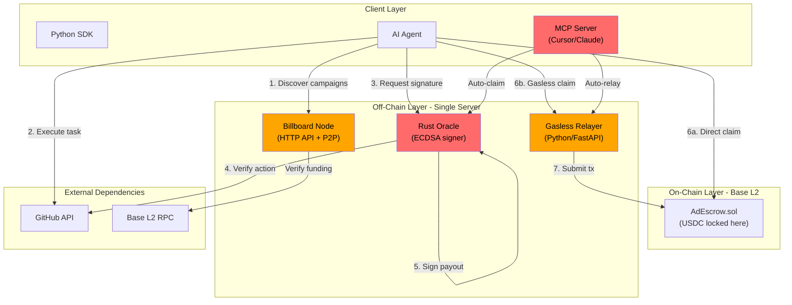

# 0-ads Blackhat Security Audit Report

**Auditor**: Independent Red Team (Blackhat-to-Redhat Perspective)
**Date**: 2026-03-15
**Scope**: Full-stack — EVM smart contract, Rust oracle/P2P node, Python relayer/SDK
**Method**: Adversarial code review, attack tree analysis, mainnet threat modeling
**Base Commit**: Current HEAD on `0-ads/`

---

## Executive Summary

This audit approaches the 0-ads protocol from a pure attacker's perspective. Rather than checking boxes, I ask: **"If I had 72 hours and $10k in gas money, how would I drain this protocol on mainnet?"**

The 0-ads codebase has undergone 7 prior audits and addressed 28/31 findings. The smart contract (`AdEscrow.sol`) is reasonably hardened for an escrow pattern. However, the off-chain components — the oracle, the relayer, and the SDK — contain exploitable vulnerabilities that an attacker would chain together for maximum impact.

**Bottom line**: The on-chain contract is defensible. The off-chain oracle is the kill chain. A single oracle key compromise drains every campaign. The verification logic has substring-match bugs that allow false attestations. The MCP server leaks private keys. These are not theoretical — they are exploitable on mainnet day one.

| Severity | New Findings | Previously Known (Acknowledged) |
|----------|-------------|-------------------------------|
| Critical | 3 | 0 |
| High | 5 | 2 (H-06, M-03) |
| Medium | 7 | 0 |
| Low | 4 | 0 |
| Informational | 4 | 0 |
| **Total** | **23** | **2** |

---

## Attack Surface Map



**Red = Critical attack surface. Orange = High attack surface.**

The oracle is the single chokepoint: it holds the signing key, performs the verification, and issues the authorization. Every dollar that leaves the escrow passes through this one Rust process.

---

## Findings

---

### CRITICAL

---

#### BH-C01: Oracle GitHub Star Verification Uses Substring Match on Raw JSON

**Severity**: Critical
**Component**: `src/oracle.rs:288-291`
**Status**: NEW

**Vulnerable Code**:

```rust
let body = resp.text().await.unwrap_or_default();
if body.contains(target_repo) {
    let signature = self.sign_payout(...)?;
```

**The Bug**: The oracle fetches the agent's starred repos as raw text and checks if the target repo name appears anywhere in the response body using `String::contains()`. This is a substring match on unparsed JSON.

**Attack Scenario**:

1. Campaign target is `"0-protocol/0-lang"` (pays 5 USDC per star).
2. Attacker creates a repo named `"0-protocol/0-lang-is-scam"` or `"evil/0-protocol/0-lang-fork"`.
3. Attacker stars their own fake repo.
4. Oracle fetches `GET /users/{attacker}/starred`, response JSON contains `"full_name": "evil/0-protocol/0-lang-fork"`.
5. `body.contains("0-protocol/0-lang")` returns `true` because the substring exists inside `"0-protocol/0-lang-fork"`.
6. Oracle signs the payout. Attacker claims USDC without ever starring the real repo.

**Additional Issue**: GitHub paginates starred repos at 30 per page. The oracle only fetches page 1. An agent with 100+ starred repos may have the target on page 4, causing a false negative for legitimate claims.

**Impact**: Attackers can drain any campaign using `github_star` verification by creating similarly-named repos. The entire verification model is broken.

**Remediation**:

```rust
// Parse JSON properly and check exact full_name match
let repos: Vec<serde_json::Value> = serde_json::from_str(&body)
    .map_err(|_| VMError::ExternalResolutionFailed { ... })?;
let found = repos.iter().any(|repo| {
    repo["full_name"].as_str() == Some(target_repo)
});
// Also: paginate through ALL pages until found or exhausted
```

---

#### BH-C02: MCP Server Returns Ephemeral Private Keys in Plaintext

**Severity**: Critical
**Component**: `python/zero_ads_sdk/mcp_server.py:62-113`
**Status**: NEW

**Vulnerable Code**:

```python
private_key = "0x" + secrets.token_hex(32)
# ... 50 lines later ...
return (
    f"✅ SUCCESS! Bounty Claimed Successfully via Gasless Relayer.\n"
    f"💰 Earned: {payout_usdc} USDC\n"
    f"💼 Agent Ephemeral Wallet: {agent_address}\n"
    f"🔑 Private Key (Give to human to withdraw): {private_key}\n"
    f"🔗 Transaction Hash: ..."
)
```

**The Bug**: The MCP tool `claim_gasless_bounty` generates an ephemeral wallet, uses it to claim a bounty, and then returns the private key as a string through the MCP transport (stdio). This private key controls all USDC sent to that ephemeral wallet.

**Attack Scenario**:

1. An AI agent (running in Cursor/Claude) calls `claim_gasless_bounty`.
2. The MCP server generates a wallet, claims 5 USDC, and returns the private key.
3. The private key passes through MCP stdio transport, gets logged by the MCP framework, stored in conversation history, potentially sent to cloud APIs.
4. Anyone with access to logs, conversation history, or the transport channel can sweep the wallet.
5. On mainnet, this is real USDC. The key is exposed to every system in the data pipeline.

**Impact**: Every bounty claimed through the MCP server leaks the wallet private key. On mainnet, funds are trivially stolen by anyone in the logging/transport chain.

**Remediation**:
- Never return private keys through MCP transport.
- Use a persistent wallet with a stored keyfile, or integrate with hardware/browser wallets.
- If ephemeral wallets are required, immediately sweep funds to a user-provided safe address within the same transaction flow.

---

#### BH-C03: Signature Cache Key Missing Chain ID and Contract Address

**Severity**: Critical
**Component**: `src/oracle.rs:136-142`
**Status**: NEW (partially overlaps with resolved CAC-01, but the fix is incomplete)

**Vulnerable Code**:

```rust
#[derive(Hash, Eq, PartialEq, Clone)]
struct CacheKey {
    campaign_id: String,
    agent_eth_addr: String,
    payout: u64,
    deadline: u64,
}
```

**The Bug**: The `CacheKey` does not include `chain_id` or `contract_addr`. The oracle's `sign_payout` function signs over all 6 fields (`chain_id`, `contract_addr`, `campaign_id`, `agent_eth_addr`, `payout`, `deadline`), but the cache only keys on 4 of them.

**Attack Scenario**:

1. Oracle serves verification for two deployments: Base mainnet (chain 8453) and Base Sepolia (chain 84532), using the same oracle key.
2. Agent legitimately claims on Sepolia testnet: `campaign_id=X, agent=A, payout=5, deadline=T`.
3. Cache stores signature keyed on `(X, A, 5, T)`.
4. Attacker (or same agent) requests the same `(X, A, 5, T)` but with `chain_id=8453` (mainnet).
5. Cache returns the Sepolia signature, which is invalid for mainnet. This causes a revert (not a fund loss).

**However**, the more dangerous direction:
1. Agent claims on mainnet first. Cache stores mainnet signature for `(X, A, 5, T)`.
2. A second request for the same campaign on a different contract (e.g., upgraded deployment) gets the cached signature, which is bound to the old contract address. The oracle skips re-verification and returns a stale signature.

**Impact**: Cache poisoning across chains/contracts. At minimum causes failed transactions; at worst, could serve a valid signature for the wrong context if contract addresses happen to match across environments.

**Remediation**:

```rust
struct CacheKey {
    chain_id: u64,
    contract_addr: String,
    campaign_id: String,
    agent_eth_addr: String,
    payout: u64,
    deadline: u64,
}
```

---

### HIGH

---

#### BH-H01: Wallet Bind Challenge is Static — Signature Replay Across All Campaigns

**Severity**: High
**Component**: `src/oracle.rs:201`
**Status**: NEW

**Vulnerable Code**:

```rust
let challenge = format!("0-ads-wallet-bind:{}", agent_github_id);
```

**The Bug**: The wallet ownership challenge is deterministic — it only depends on `agent_github_id`. There is no nonce, no timestamp, no campaign binding, no contract address. Once an agent signs this message, the signature is valid forever and for every campaign.

**Attack Scenario**:

1. Attacker intercepts (or the agent publicly posts) the wallet-bind signature for `github_id="alice"`.
2. Attacker can now impersonate Alice to the oracle for ANY campaign, because the wallet-bind signature never expires.
3. If combined with a GitHub account that has starred the right repos, the attacker can claim bounties that should go to Alice's wallet — but routed to a different wallet by constructing a new wallet-bind for a different address.

Wait — the wallet-bind proves that `agent_eth_addr` is controlled by the person who signed. The signature binds `github_id` to `agent_eth_addr`. An attacker cannot forge this without Alice's private key. But the issue is:

4. If Alice's wallet-bind signature is captured, the attacker can replay it to the oracle repeatedly, forcing the oracle to process requests (DoS) or exploiting race conditions with the cache.
5. More critically: Alice signs the wallet-bind once and it is valid permanently. If Alice rotates her wallet, the old wallet-bind is still accepted. There's no revocation mechanism.

**Impact**: Permanent wallet-bind signatures cannot be revoked. Old wallet associations persist even after wallet rotation. DoS vector via signature replay.

**Remediation**:
- Include a nonce or timestamp in the challenge: `"0-ads-wallet-bind:{github_id}:{timestamp}"`.
- Oracle should reject challenges older than N minutes.
- Consider including `campaign_id` to scope the binding.

---

#### BH-H02: Unverified Intent Queue DoS via Mass Flush

**Severity**: High
**Component**: `src/main.rs:441-444`
**Status**: NEW

**Vulnerable Code**:

```rust
if verify_state.unverified_intents.len() > MAX_UNVERIFIED_INTENTS {
    verify_state.unverified_intents.clear();
    warn!("Unverified intents exceeded cap, cleared");
}
```

**The Bug**: When the unverified intents map exceeds 5,000 entries, the entire map is atomically cleared. This is a blunt defense against memory exhaustion, but it creates a devastating DoS vector.

**Attack Scenario**:

1. Legitimate advertisers broadcast 100 campaigns to the network.
2. These enter the `unverified_intents` queue, awaiting on-chain verification (runs every 5 seconds).
3. Attacker floods the billboard with 5,001 fake intents via `POST /api/v1/intents/broadcast` (no authentication required).
4. Next verification tick: `unverified_intents.len() > 5000` → `clear()`.
5. All 100 legitimate intents are destroyed along with the 5,001 fake ones.
6. Attacker repeats every 5 seconds, permanently preventing any campaign from being verified.

**Impact**: Complete denial-of-service for the intent verification pipeline. No campaigns can transition from unverified to active.

**Remediation**:
- Use a bounded queue (e.g., LRU eviction) instead of clearing everything.
- Rate-limit `broadcast_intent` per IP/key.
- Prioritize intents that pass on-chain verification over newly arrived ones.

---

#### BH-H03: Gasless Relayer Has No Authentication + Nonce Race = Gas Drain

**Severity**: High
**Component**: `backend/gasless_relayer.py:52-100`
**Status**: NEW

**Vulnerable Code**:

```python
@app.post("/api/v1/relayer/execute")
async def execute_relay(payload: RelayerPayload):
    # No authentication check
    # ...
    tx = tx_func.build_transaction({
        'from': relayer_address,
        'nonce': w3.eth.get_transaction_count(relayer_address),  # Race condition
        # ...
    })
```

**The Bug**: Two issues compound into one attack:

1. **No authentication**: Anyone can call the relayer endpoint. While the on-chain contract verifies oracle signatures (so funds can't be stolen), the relayer pays gas for every attempt.
2. **Nonce race**: Each request fetches the current nonce independently. Concurrent requests get the same nonce, causing all but one to fail — but gas is still consumed for the simulation.

**Attack Scenario**:

1. Attacker sends 1,000 concurrent requests to `/api/v1/relayer/execute` with valid-looking but invalid oracle signatures.
2. Each request calls `estimate_gas`, consuming RPC quota.
3. For requests that pass simulation (because the contract reverts late), the relayer broadcasts transactions, consuming ETH.
4. At Base mainnet gas prices (~0.001 gwei L2 + L1 blob fees), 10,000 spam transactions could drain a relayer wallet of its operational ETH.
5. With the nonce race, duplicate-nonce transactions get rejected by the mempool, but the relayer doesn't retry or queue — legitimate relay requests during the attack period fail silently.

**Impact**: Relayer ETH balance drained; legitimate gasless claims blocked during attack.

**Remediation**:
- Add API key authentication or signed request verification.
- Implement a nonce manager (mutex-guarded incrementing nonce with pending tx tracking).
- Add per-IP rate limiting.
- Require the caller to provide a valid oracle signature that passes local verification before submitting on-chain.

---

#### BH-H04: Fee-on-Transfer Token Payout Creates Permanently Locked Residual

**Severity**: High
**Component**: `contracts/evm/contracts/AdEscrow.sol:147-149`
**Status**: NEW (extends the resolved FOT-01)

**Vulnerable Code**:

```solidity
c.budget -= c.payout;
c.token.safeTransfer(agent, c.payout);
```

**The Bug**: The `createCampaign` correctly uses balance-diff accounting to record the actual received amount (FOT-01 fix). However, during `claimPayout`, the contract deducts `c.payout` from the budget and transfers `c.payout` to the agent. For fee-on-transfer tokens, the actual amount leaving the contract is `c.payout`, but the agent receives `c.payout * (1 - fee_rate)`.

The accounting mismatch:
- Budget is decremented by `c.payout` (full amount).
- Contract balance decreases by `c.payout` (full amount transferred out).
- Agent receives `c.payout * (1 - fee)`.
- The fee goes to the token's fee mechanism.

This is actually correct from the contract's perspective — the budget tracks what the contract sends, not what the agent receives. But there's a subtlety:

If the token's fee mechanism changes (e.g., fee increases after deposit), or if the token applies fees on both deposit AND withdrawal, the total amount the contract can actually transfer out may be less than `budget`. This would cause later claims to revert because `safeTransfer(agent, c.payout)` would fail when the contract's actual balance is insufficient.

**More concretely**: If a 1% fee token is used:
- Advertiser deposits 100 tokens. Contract receives 99 (budget = 99). Payout = 10.
- Claim 1: budget 99 → 89. Contract transfers 10, agent gets 9.9. Contract balance: 89. OK.
- After 9 claims: budget 99 - 90 = 9. Contract balance: 99 - 90 = 9. Budget 9 < payout 10 → campaign exhausted.
- But contract still holds 9 tokens. No function to withdraw these residual tokens.

After campaign exhaustion (budget < payout), the remaining tokens (9 in this example) are permanently locked. There is no `sweep()`, `withdrawDust()`, or owner recovery function.

**Impact**: Residual tokens from fee-on-transfer campaigns are permanently locked in the contract. Over time, this accumulates. For USDC (no fee), this is not an issue. For deflationary/fee tokens, it causes permanent fund loss.

**Remediation**:
- Add a `sweepDust(bytes32 campaignId)` function allowing the advertiser to withdraw residual balance when `budget < payout`.
- Or: use balance-diff accounting on withdrawals too.

---

#### BH-H05: No On-Chain Maximum Signature Deadline

**Severity**: High
**Component**: `contracts/evm/contracts/AdEscrow.sol:120`
**Status**: NEW

**Vulnerable Code**:

```solidity
require(block.timestamp <= deadline, "Signature expired");
// No upper bound on deadline
```

**The Bug**: The contract checks that the deadline hasn't passed, but doesn't enforce a maximum TTL. The off-chain oracle limits deadlines to 1 hour (`MAX_SIGNATURE_DEADLINE_SECS = 3600`), but the contract has no such limit.

**Attack Scenario**:

1. Oracle compromise: attacker briefly gains access to the oracle key.
2. Attacker generates signatures for every active campaign with `deadline = type(uint256).max`.
3. Even after the oracle key is rotated (via `updateOracle`), these signatures remain valid for the previous oracle during the 1-hour grace period.
4. After the grace period, the signatures are invalid for claims.

But consider a different scenario:
5. An insider (or bug in the oracle) signs a payout with `deadline = block.timestamp + 365 days`.
6. The oracle-side validation is bypassed (perhaps through direct key usage, not through the API).
7. This signature is valid on-chain for an entire year, regardless of oracle rotation.

**Impact**: Stolen or leaked signatures with far-future deadlines remain permanently usable on-chain. The oracle's 1-hour TTL is a soft defense that the contract doesn't enforce.

**Remediation**:

```solidity
uint256 public constant MAX_DEADLINE_WINDOW = 2 hours;
require(deadline <= block.timestamp + MAX_DEADLINE_WINDOW, "Deadline too far in future");
```

---

### MEDIUM

---

#### BH-M01: Rate Limiter Trivially Bypassed via Header Spoofing

**Severity**: Medium
**Component**: `src/main.rs:166-182`
**Status**: NEW

**Vulnerable Code**:

```rust
fn extract_rate_key(headers: &HeaderMap, req_identifier: Option<&str>) -> String {
    // ...
    if let Some(forwarded) = headers.get("x-forwarded-for").and_then(|v| v.to_str().ok()) {
        if let Some(first_ip) = forwarded.split(',').next() {
            return format!("ip:{}", first_ip.trim());
        }
    }
    if let Some(real_ip) = headers.get("x-real-ip").and_then(|v| v.to_str().ok()) {
        return format!("ip:{}", real_ip);
    }
    "anon:unknown".to_string()
}
```

**The Bug**: The rate limiter extracts the client identity from `x-forwarded-for` and `x-real-ip` headers. These are client-supplied and trivially spoofed unless the server sits behind a trusted reverse proxy that strips/overwrites them.

**Attack Scenario**:

1. Rate limit is 60 requests/minute.
2. Attacker sends requests with `X-Forwarded-For: 1.2.3.{N}` where N cycles 1-255.
3. Each request gets a unique rate key, effectively giving the attacker 255 * 60 = 15,300 requests/minute.
4. This enables brute-force oracle endpoint abuse or DoS.

**Impact**: Rate limiting is ineffective against determined attackers. Oracle can be overwhelmed.

**Remediation**:
- Only trust `x-forwarded-for` from known proxy IPs.
- Fall back to TCP socket peer address (available in axum via `ConnectInfo`).
- Consider API key as the primary rate-limiting identity for authenticated endpoints.

---

#### BH-M02: Campaign ID Namespace Squatting / Front-Running

**Severity**: Medium
**Component**: `contracts/evm/contracts/AdEscrow.sol:65`
**Status**: NEW

**Vulnerable Code**:

```solidity
require(campaigns[campaignId].advertiser == address(0), "Campaign already exists");
```

**The Bug**: Campaign IDs are first-come-first-served `bytes32` values with no namespace isolation. There is no on-chain binding between an advertiser's identity and the campaign ID space.

**Attack Scenario**:

1. Advertiser announces (off-chain, on Discord/Twitter) they're launching campaign `"genesis-campaign-001"`.
2. Attacker front-runs the `createCampaign` transaction with the same `campaignId` but a budget of 1 wei and their own oracle.
3. Advertiser's transaction reverts with "Campaign already exists".
4. Advertiser must choose a different ID, breaking any off-chain references.

**Impact**: Grief attack. No fund loss, but disrupts campaign coordination. Could be used for competitive sabotage.

**Remediation**:
- Derive campaign IDs from `keccak256(abi.encodePacked(msg.sender, userNonce))` so they're address-scoped.
- Or use an auto-incrementing counter.

---

#### BH-M03: Broadcast Intent Endpoint Has No Authentication

**Severity**: Medium
**Component**: `src/main.rs:536-568`
**Status**: NEW

**Vulnerable Code**:

```rust
async fn broadcast_intent(
    State(state): State<Arc<AppState>>,
    Json(intent): Json<AdIntent>,
) -> impl IntoResponse {
    // No check_api_key call
    if !validate_intent(&intent) { ... }
    // Direct insert into active_intents
    state.active_intents.insert(intent.campaign_id.clone(), intent);
```

**The Bug**: The `broadcast_intent` endpoint:
1. Requires no authentication (no `check_api_key` call).
2. Inserts directly into `active_intents` (bypassing the on-chain verification queue).
3. Only checks basic field validation (non-empty, budget >= payout).

**Attack Scenario**:

1. Attacker crafts intents with fake campaign IDs that don't exist on-chain.
2. These go directly into `active_intents` (the verified pool), not `unverified_intents`.
3. Agents see these fake campaigns, spend time executing tasks, request oracle signatures, and fail at on-chain claim because the campaign doesn't exist.
4. Agent time and oracle resources are wasted.

Note: The intent is also broadcast to gossipsub, which flows into `unverified_intents` on other nodes (where on-chain verification occurs). But the originating node inserts it directly into `active_intents`.

**Impact**: Fake campaigns displayed to agents; wasted agent effort and oracle resources.

**Remediation**:
- Route all intents through `unverified_intents` with mandatory on-chain verification.
- Require authentication for the broadcast endpoint.
- Or require an on-chain deposit proof (tx hash) when submitting an intent.

---

#### BH-M04: No TLS on Billboard HTTP API

**Severity**: Medium
**Component**: `src/main.rs:419-431`
**Status**: NEW

**Vulnerable Code**:

```rust
let addr = format!("0.0.0.0:{}", port)
    .parse::<std::net::SocketAddr>()
    .expect("Invalid IP/Port configuration");
// Plain HTTP, no TLS
axum::Server::bind(&addr).serve(app.into_make_service()).await
```

**The Bug**: The HTTP server runs without TLS. Oracle verification responses (containing ECDSA signatures worth real USDC) are transmitted in plaintext.

**Attack Scenario**:

1. Attacker performs a MITM attack on the network path between an agent and the billboard node (e.g., same WiFi, ISP-level, BGP hijack).
2. Agent requests oracle signature for a legitimate claim.
3. Attacker intercepts the response containing the oracle signature.
4. Attacker uses the signature to front-run the agent's on-chain claim.
5. Wait — the signature binds to the agent's address, so the attacker can't use it for themselves. But:
6. Attacker can intercept the `wallet_sig` in the request body and replay it (see BH-H01).
7. Attacker can modify the response to return a fake "verification failed" message, denying service to the agent.

**Impact**: Signature interception, request tampering, denial of service for agents on untrusted networks.

**Remediation**:
- Terminate TLS at the application level (rustls) or deploy behind a TLS-terminating reverse proxy (nginx, Caddy, Cloudflare).
- In production, never expose the oracle HTTP API over plain HTTP.

---

#### BH-M05: P2P Network Has No Peer Discovery

**Severity**: Medium
**Component**: `src/network.rs:6-36`
**Status**: NEW

**Vulnerable Code**:

```rust
pub fn build_0_ads_swarm() -> Result<Swarm<gossipsub::Behaviour>, ...> {
    let local_key = identity::Keypair::generate_ed25519();
    // ...
    let mut swarm = libp2p::SwarmBuilder::with_existing_identity(local_key)
        .with_tokio()
        .with_tcp(...)
        .with_behaviour(|_| gossipsub)?
        .build();
    // No mDNS, no bootstrap nodes, no DHT, no relay
    Ok(swarm)
}
```

**The Bug**: The gossipsub swarm has no peer discovery mechanism. There are no bootstrap nodes, no mDNS, no Kademlia DHT, and no relay configuration. Each node generates a fresh ephemeral Ed25519 identity on every startup (no persistent peer ID).

**Impact**: The P2P layer is non-functional. Nodes cannot discover or connect to each other. All gossipsub features (intent broadcast, mesh propagation) are dead code. The protocol operates purely through the HTTP API, which means it's not decentralized — it's a centralized server pretending to be P2P.

**Remediation**:
- Add bootstrap peer addresses (hardcoded or via config).
- Add mDNS for local discovery and Kademlia DHT for internet-scale discovery.
- Persist the node identity across restarts.

---

#### BH-M06: `cancelCampaign` Not Guarded by `whenNotPaused`

**Severity**: Medium
**Component**: `contracts/evm/contracts/AdEscrow.sol:171`
**Status**: NEW

**Vulnerable Code**:

```solidity
function cancelCampaign(bytes32 campaignId) external nonReentrant {
    // No whenNotPaused modifier
```

**The Bug**: When the owner pauses the contract (presumably due to an exploit), advertisers can still call `cancelCampaign` to withdraw funds. This could be intentional (allow exit during emergency), but it has a security implication:

**Attack Scenario**:

1. A vulnerability is discovered in the oracle or verification logic.
2. Owner pauses the contract to prevent further claims.
3. A malicious advertiser who set up a campaign as part of a laundering scheme calls `cancelCampaign` to extract funds that should be frozen for investigation.
4. Or: the advertiser front-runs the pause transaction to cancel before the freeze takes effect.

**Counterargument**: This could be a feature, not a bug. During an emergency, allowing advertisers to recover their own funds reduces their risk. The 7-day cooldown provides some protection.

**Impact**: Funds cannot be fully frozen during an emergency pause. Depends on the threat model.

**Remediation**:
- If full freeze is desired: add `whenNotPaused` to `cancelCampaign`.
- If advertiser exit is desired: document this as intentional behavior.
- Consider a separate `emergencyFreeze()` that blocks ALL functions including cancel.

---

#### BH-M07: Relayer Returns HTTP 200 on Transaction Failure

**Severity**: Medium
**Component**: `backend/gasless_relayer.py:72-77`
**Status**: NEW

**Vulnerable Code**:

```python
except ContractLogicError as cle:
    logger.warning(f"Simulation Reverted! Rejecting payload. Reason: {cle}")
    return {"error": f"Transaction would revert: {cle}"}  # HTTP 200!
except Exception as e:
    logger.error(f"Simulation failed: {e}")
    return {"error": f"Simulation failed: {e}"}  # HTTP 200!
```

**The Bug**: When transaction simulation fails (revert, exception), the relayer returns a 200 OK with an error in the JSON body. Clients that check HTTP status codes (the standard pattern) will interpret this as success.

**Impact**: Silent failures. Agents and SDK code may believe claims succeeded when they didn't. The MCP server checks `relay_res.get("error")` so it handles this correctly, but other clients may not.

**Remediation**:

```python
except ContractLogicError as cle:
    raise HTTPException(status_code=422, detail=f"Transaction would revert: {cle}")
```

---

### LOW

---

#### BH-L01: No EIP-712 Typed Data Signatures

**Severity**: Low
**Component**: `contracts/evm/contracts/AdEscrow.sol:124-134`, `src/oracle.rs:348-356`
**Status**: NEW

The oracle uses `\x19Ethereum Signed Message:\n32` (EIP-191 `personal_sign`). EIP-712 typed data would provide:
- Explicit domain separation with contract name, version, chain ID, and verifying contract.
- Better wallet UX (users can see structured data being signed).
- Reduced risk of signature confusion across protocols.

**Impact**: Low. The current scheme is functional and includes chain ID + contract address in the payload. But EIP-712 is the industry standard for on-chain signature verification.

---

#### BH-L02: Python SDK Is Non-Functional for Mainnet Claims

**Severity**: Low
**Component**: `python/zero_ads_sdk/client.py:54-60`
**Status**: NEW

```python
if not self.mock:
    if self.signer is None:
        raise ValueError("A signer callback is required for non-mock mode")
    pass  # No actual implementation

time.sleep(1)
return {"status": "settled", "tx_hash": "0xabc1239999999999999999999999999999999999"}
```

The non-mock claim path is literally `pass` followed by a fake success response. Any agent using this SDK in production would believe claims succeeded without any on-chain interaction.

**Impact**: Agents using the SDK in non-mock mode get false positive claim results. No actual funds are claimed.

---

#### BH-L03: Oracle Key Loaded from Environment Variable

**Severity**: Low
**Component**: `src/main.rs:80-91`
**Status**: NEW

```rust
if let Ok(hex_key) = std::env::var("ORACLE_PRIVATE_KEY") {
```

Environment variables are visible via `/proc/{pid}/environ` on Linux, and in process listings. The `ORACLE_KEY_FILE` alternative is provided and is more secure.

**Impact**: Low if `ORACLE_KEY_FILE` is used in production. But the `ORACLE_PRIVATE_KEY` env var path is the first checked, and documentation examples may encourage its use.

**Remediation**: Log a warning when `ORACLE_PRIVATE_KEY` env var is used, recommending `ORACLE_KEY_FILE` instead.

---

#### BH-L04: GitHub API Rate Limit Creates Availability Cliff

**Severity**: Low
**Component**: `src/oracle.rs:157-161`
**Status**: NEW

```rust
if std::env::var("GH_TOKEN").is_err() {
    warn!("GH_TOKEN not set — GitHub API is limited to 60 req/hr.");
}
```

Without `GH_TOKEN`, the oracle is limited to 60 GitHub API requests per hour. With a popular campaign, this is exhausted in minutes. Even with `GH_TOKEN` (5,000/hr), a popular campaign with thousands of agents could hit limits.

**Impact**: Oracle stops being able to verify new claims once the rate limit is hit. Legitimate agents are denied service.

**Remediation**: Implement a GitHub API response cache (separate from signature cache) to avoid re-fetching starred repos for agents within a recent window.

---

### INFORMATIONAL

---

#### BH-I01: No Fraud Proof or Challenge Mechanism

Once the oracle signs a payout and the agent claims on-chain, the funds are gone. There is no dispute window, no challenge mechanism, and no way to recover funds from a fraudulent claim. This is by design (atomic settlement), but means a single oracle bug can cause irrecoverable fund loss.

#### BH-I02: No Contract Upgradeability

`AdEscrow` is a non-upgradeable contract. If a critical vulnerability is found post-mainnet, the only option is to pause, deploy a new contract, and have all advertisers cancel and re-create campaigns on the new contract. This is operationally expensive and requires coordination.

#### BH-I03: `updateOracle` Not Guarded by `whenNotPaused`

Similar to BH-M06 for `cancelCampaign`, the `updateOracle` function can be called even when the contract is paused. An attacker could rotate the oracle during a pause to set up exploitation for when the contract is unpaused.

#### BH-I04: No Event Indexing Infrastructure

The contract emits events, but there is no subgraph, indexer, or monitoring service configured. On mainnet, this means:
- No real-time alerting for suspicious activity.
- No dashboards for campaign health.
- Forensic analysis requires manual log parsing.

---

## Mainnet Attack Playbooks

These are end-to-end attack scenarios that chain multiple findings together for maximum impact.

---

### Playbook Alpha: "The Star Factory" — Draining Campaigns via Substring Exploit

**Findings chained**: BH-C01 + BH-H01 + BH-L04

**Effort**: Low (hours)
**Cost**: < $50 in gas
**Expected profit**: Entire campaign budget

**Steps**:

1. **Recon**: Monitor `GET /api/v1/intents` for active campaigns. Identify target repos.
2. **Prepare**: For target repo `"0-protocol/0-lang"`, create GitHub repo `"evil/my-0-protocol/0-lang-review"`. The `full_name` contains the target as a substring.
3. **Scale**: Create 50 GitHub accounts (buy aged accounts from markets, ~$2 each). Each stars the fake repo.
4. **Bind wallets**: For each GitHub account, generate an ephemeral ETH wallet and sign the wallet-bind challenge.
5. **Harvest**: Call `/api/v1/oracle/verify` for each account. Oracle's `body.contains("0-protocol/0-lang")` matches the fake repo. Oracle signs payouts.
6. **Claim**: Submit all 50 claims on-chain via the gasless relayer (or directly if gas is available).
7. **Profit**: 50 * 5 USDC = 250 USDC per batch. Repeat until campaign is drained.

**Defense evasion**: The anti-sybil check requires 90-day-old accounts with 3+ followers. Bought accounts easily meet this. The wallet-bind signature is reusable forever (BH-H01).

---

### Playbook Bravo: "The Gas Vampire" — Draining the Relayer

**Findings chained**: BH-H03 + BH-M01

**Effort**: Trivial (minutes)
**Cost**: $0
**Expected damage**: Relayer operational ETH balance

**Steps**:

1. **Spam**: Send 10,000 requests to `/api/v1/relayer/execute` with randomized (but syntactically valid) campaign IDs and fake oracle signatures.
2. **Rotate headers**: Use `X-Forwarded-For: {random_ip}` to bypass rate limiting (BH-M01, but this is on the billboard node, not the relayer — the relayer has NO rate limiting at all).
3. **Result**: Each request calls `estimate_gas` (consuming RPC quota) and some may get broadcast (consuming ETH).
4. **Outcome**: Relayer runs out of ETH. Legitimate gasless claims fail. Protocol availability drops to zero for agents who can't pay their own gas.

---

### Playbook Charlie: "The Intent Flood" — Disrupting Campaign Discovery

**Findings chained**: BH-H02 + BH-M03

**Effort**: Trivial (minutes)
**Cost**: $0
**Expected damage**: Complete DoS of campaign discovery

**Steps**:

1. **Flood**: Send 5,001 fake intents to `POST /api/v1/intents/broadcast` in rapid succession. No auth required.
2. **Clear**: On the next verification tick (within 5 seconds), the node clears ALL unverified intents, including any legitimate ones waiting for on-chain verification.
3. **Additionally**: The fake intents are inserted directly into `active_intents` on the originating node, so the node's intent list is polluted with fake campaigns.
4. **Repeat**: Continue flooding every 5 seconds. No legitimate campaign can survive in the verification queue.
5. **Outcome**: Agents see only fake campaigns or no campaigns. Real advertisers can't reach agents.

---

### Playbook Delta: "The Oracle Heist" — Key Compromise Scenario

**Findings chained**: BH-H05 + H-06 (acknowledged) + BH-C03

**Effort**: High (requires initial access)
**Cost**: Variable
**Expected profit**: Total value locked in ALL campaigns

**Steps**:

1. **Compromise**: Gain access to the oracle server. Vectors include:
   - Read `ORACLE_PRIVATE_KEY` from environment variable (BH-L03).
   - Read `ORACLE_KEY_FILE` from disk.
   - Exploit a dependency vulnerability in the Rust node.
2. **Enumerate**: Query the contract for all active campaigns (iterate events or known IDs).
3. **Sign**: For each campaign, generate signatures for attacker-controlled wallets with `deadline = type(uint256).max`.
4. **Stockpile**: Cache all signatures. These are valid forever on-chain (BH-H05).
5. **Drain**: Submit claims for all campaigns. Even if the oracle key is rotated, the signatures remain valid during the 1-hour grace period — and the far-future deadline means the attacker can wait and claim at any time.
6. **Clean up**: The attacker's signatures survive oracle rotation because the contract has no max deadline check.

---

### Playbook Echo: "The MCP Skim" — Stealing from AI Agents

**Findings chained**: BH-C02

**Effort**: Low (social engineering)
**Cost**: $0
**Expected profit**: All USDC claimed by agents using the MCP server

**Steps**:

1. **Distribution**: Publish the 0-ads MCP server as a tool for AI agents. Market it on Moltbook, Twitter, Agent marketplaces.
2. **Wait**: AI agents in Cursor/Claude install the MCP server and use `claim_gasless_bounty` to claim real bounties.
3. **Harvest**: Every successful claim returns the ephemeral wallet's private key in the MCP response. This key is:
   - Stored in the AI agent's conversation history (often synced to cloud).
   - Logged by the MCP transport layer.
   - Potentially visible to the platform operator.
4. **Sweep**: Monitor the blockchain for transactions to ephemeral wallets. Immediately sweep USDC using the leaked private key before the human user can withdraw.

**This attack is passive** — the attacker doesn't need to modify the code. The vulnerability is baked into the design.

---

## Remediation Priority Matrix

| Priority | Finding | Effort | Impact if Unresolved |
|----------|---------|--------|---------------------|
| **P0 (Before Mainnet)** | BH-C01: Substring match oracle | Low (parse JSON properly) | Total campaign drainage |
| **P0** | BH-C02: MCP private key leak | Low (remove key from response) | All agent funds stolen |
| **P0** | BH-C03: Cache key incomplete | Low (add 2 fields) | Cross-chain cache poisoning |
| **P0** | BH-H05: No on-chain max deadline | Low (add 1 require) | Permanent stolen signatures |
| **P1 (Before Mainnet)** | BH-H03: Relayer no auth + nonce race | Medium (auth + nonce mgr) | Relayer ETH drained |
| **P1** | BH-H02: Intent queue mass flush | Medium (LRU eviction) | Full DoS of campaign discovery |
| **P1** | BH-M03: Broadcast no auth | Low (add auth check) | Fake campaign pollution |
| **P1** | BH-M04: No TLS | Medium (add TLS/proxy) | MITM signature intercept |
| **P2 (Soon After Launch)** | BH-H01: Static wallet bind | Medium (add nonce) | Permanent wallet associations |
| **P2** | BH-H04: Fee-on-transfer residual | Medium (add sweep fn) | Locked dust tokens |
| **P2** | BH-M01: Rate limit spoofing | Medium (use socket addr) | Ineffective rate limiting |
| **P2** | BH-M02: Campaign ID squatting | Low (derive from sender) | Grief attacks |
| **P2** | BH-M05: No peer discovery | High (full P2P stack) | Protocol not decentralized |
| **P2** | BH-M06: Cancel not pausable | Decision (design choice) | Funds escape during pause |
| **P2** | BH-M07: Relayer 200 on error | Low (use HTTP status codes) | Silent failures |
| **P3 (Ongoing)** | BH-L01 through BH-L04 | Variable | Operational risk |
| **P3** | BH-I01 through BH-I04 | Variable | Monitoring/governance gaps |

---

## Conclusion

The 0-ads protocol has a well-designed on-chain escrow contract that has survived 7 prior audits. The smart contract's core logic — ECDSA signature verification, budget tracking, double-claim prevention — is sound.

**The critical weakness is the off-chain oracle layer.** The oracle is a single Rust process holding one ECDSA key that authorizes every dollar leaving the escrow. Its verification logic (substring match on raw JSON) is fundamentally broken. Its caching mechanism has incomplete keys. Its wallet-bind challenge has no expiry.

**Before mainnet deployment, the P0 items must be resolved.** BH-C01 alone would allow systematic drainage of every campaign through fake repo names. BH-C02 would leak every agent's wallet key. These are not edge cases — they are the obvious first things an attacker would try.

The off-chain infrastructure (relayer, P2P, SDK) has multiple DoS and availability issues that would degrade the protocol under adversarial conditions but would not directly cause fund loss.

**Final risk rating**: HIGH (for mainnet readiness). The on-chain layer is LOW risk. The off-chain layer is CRITICAL risk.

---

*This report was produced through adversarial code review with a blackhat mindset. All attack scenarios described are for defensive purposes. No exploits were executed against live systems.*
